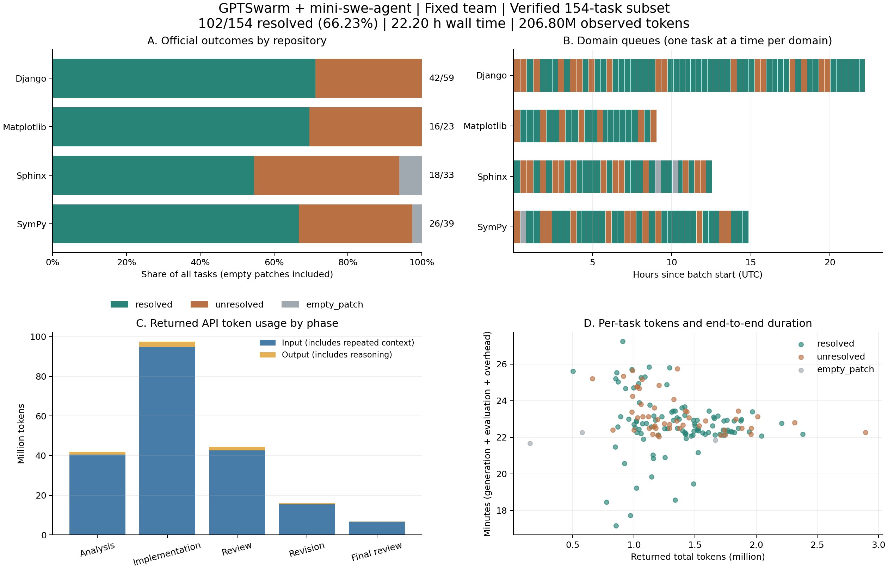

# GPTSwarm＋mini-swe-agent 固定团队全量实验报告

批次：`mini_full_20260918_domains_v4b`；报告生成时间：2026-09-20T01:36:23.109875+00:00。

本批在本地 SWE-bench Verified **154 题子集**上得到 **102/154（66.23%）** 官方解决率；49 题未解决、3 题空补丁。该数字不能直接视为完整 Verified 测试集的成绩。



**实验范围与配置**

- 固定原生 Swarm 协作图，关闭节点与边优化；三种逻辑角色 Analyst、Engineer、Reviewer，使用相同 mini 实现和模型、不同角色提示词。
- 五阶段：分析 → 实现 → 初审 → 返工 → 最终复核；初审批准且补丁未变时可跳过后两阶段。最多一轮返工，最后从真实工作区导出补丁。
- mini-swe-agent 2.4.6（含本地适配，实际包副本已冻结）；模型 `DeepSeek-V4-Flash-0731`，temperature=0.2。
- 四个仓库域并行、域内逐题生成并官方评估；每题一次正式尝试，不复用单题试跑结果，无任务级自动重试。API 内部重试仍启用。
- 每题共享生成预算 1,200 秒；阶段建议时间依次为 240/420/240/180/120 秒，属于交接提示，不是独立硬配额。单次 API timeout 上限 300 秒、max_tokens=16,384、命令 timeout=120 秒。
- 阶段 step 上限依次为 30/80/35/40/20；官方评估测试 timeout=1,800 秒，整题子进程兜底 timeout=3,600 秒。
- 模型输入仅公开问题描述，不提供 hints、标准补丁或隐藏评估测试名。生成前恢复精确 base commit，清除其他 Git 历史；生成与评估 Docker 均断网。
- 本报告只统计 v4b 正式批次；预检、此前单题调试和被中断的 v4 启动批次不计入时间/token 总数。

**官方结果**

| 仓库域 | 题数 | 解决 | 未解决 | 空补丁 | 解决率 |
|---|---:|---:|---:|---:|---:|
| django/django | 59 | 42 | 17 | 0 | 71.19% |
| matplotlib/matplotlib | 23 | 16 | 7 | 0 | 69.57% |
| sphinx-doc/sphinx | 33 | 18 | 13 | 2 | 54.55% |
| sympy/sympy | 39 | 26 | 12 | 1 | 66.67% |
| **总计** | **154** | **102** | **49** | **3** | **66.23%** |

154 份任务汇总报告均已核对；151 份非空补丁详细评估报告，151 份补丁成功应用，无官方评估错误或报告缺失。空补丁按失败计入 154 题分母，但没有启动测试容器。

空补丁题：`sphinx-doc__sphinx-9229`、`sphinx-doc__sphinx-9320`、`sympy__sympy-13031`。

**运行时间**

- 开始：2026-09-18T12:16:59.144188+00:00；结束：2026-09-19T10:29:01.818834+00:00（均为 UTC）。
- 整批墙钟时间：**22.201 小时**。
- 全部任务累计端到端时间：**58.630 任务小时**；这是各题生成、评估和收尾时间之和，不是机器 CPU/GPU 使用时长。
- 平均活动任务数：2.641（累计任务时间 / 批次墙钟时间），不等同于相对于串行实验的实测加速比。

| 时间口径 | 均值（分钟） | 中位数（分钟） | P90（分钟） | P95（分钟） | 最大值（分钟） |
|---|---:|---:|---:|---:|---:|
| 逐题端到端 | 22.84 | 22.70 | 24.92 | 25.41 | 27.24 |
| 生成运行轨迹跨度 | 19.84 | 20.11 | 20.17 | 20.19 | 20.64 |
| 剩余评估及进程开销（估算） | 3.00 | 2.67 | 4.80 | 5.29 | 7.08 |

端到端时间来自批调度器逐题 started/finished。生成轨迹跨度取该题最后一条 runtime 事件的 monotonic elapsed，覆盖环境准备和角色工作，但不是完整生成进程的精确计时；二者差额包含启动、最终导出/清理、官方评估和报告开销，**不能作为纯 eval 测试耗时**。API 调用等待、限流重试和工具执行均包含在相应墙钟时间内。分位数使用线性插值。

| 仓库域 | 队列跨度（小时） | 平均端到端（分钟/题） | 平均 token/题 | 总 token（百万） |
|---|---:|---:|---:|---:|
| django/django | 22.20 | 22.58 | 1,455,737 | 85.888 |
| matplotlib/matplotlib | 9.04 | 23.58 | 1,046,810 | 24.077 |
| sphinx-doc/sphinx | 12.54 | 22.79 | 1,419,294 | 46.837 |
| sympy/sympy | 14.85 | 22.85 | 1,282,055 | 50.000 |

**Token 消耗**

| 指标 | 数值 |
|---|---:|
| 输入 prompt tokens | 200,212,805 |
| 输出 completion tokens | 6,589,142 |
| **总 tokens** | **206,801,947** |
| 其中 reasoning tokens（已含在输出中） | 3,085,673 |
| 接口报告 cached input tokens（已含在输入中） | 168,371,968 |
| 输入中 cached 占比 / 输出中 reasoning 占比 | 84.10% / 46.83% |
| 平均 / 中位数每题总 tokens | 1,342,870 / 1,315,180 |
| 每题总 tokens P90 / P95 / 最大值 | 1,829,446 / 1,958,629 / 2,895,292 |
| 全批 token / 解决题数（含失败题开销的摊销） | 2,027,470 |

仅逐行累计各阶段 `events.jsonl` 的 `model_response.usage`；没有再次累计 trace、消息交接或 result 中的重复用量。收到 12,193 个响应，其中 0 个缺少完整基础 usage；reasoning 字段覆盖 12,193 个响应，cached 字段覆盖 12,193 个响应。

输入 token 每次请求重复发送的历史上下文均照接口用量计入，并非去重文本量。Reasoning 是 completion 的子集，cached 是 prompt 的子集，均不得再加到 total；接口报告的缓存量不代表已核验供应商折扣。失败/超时请求及被截止取消的请求可能已在服务端消耗 token，但未返回 usage，因此报告总量只是**可观测返回用量，不是完整账单**。未获取可信账单及本账户价格，故不估算货币费用。

| 结果组 | 题数 | 平均总 token/题 | 中位数 token/题 | 平均端到端（分钟） |
|---|---:|---:|---:|---:|
| resolved | 102 | 1,351,864 | 1,344,398 | 22.68 |
| unresolved | 49 | 1,357,524 | 1,204,880 | 23.24 |
| empty_patch | 3 | 797,725 | 576,751 | 21.93 |

**角色耗时、用量与完成情况**

| 阶段 | 实际启动 | Submitted | 平均配对阶段耗时（秒） | 输入 token | 输出 token | reasoning token | 总 token 占比 |
|---|---:|---:|---:|---:|---:|---:|---:|
| 分析 | 154 | 140 | 298.6（n=154） | 40,601,739 | 1,378,843 | 580,126 | 20.30% |
| 实现 | 153 | 148 | 455.0（n=153） | 94,861,149 | 2,574,363 | 1,402,389 | 47.12% |
| 初审 | 147 | 112 | 277.7（n=147） | 42,590,336 | 1,790,738 | 797,182 | 21.46% |
| 返工 | 111 | 72 | 128.3（n=111） | 15,544,926 | 583,515 | 218,293 | 7.80% |
| 最终复核 | 56 | 26 | 107.8（n=56） | 6,614,655 | 261,683 | 87,683 | 3.33% |

实际启动按 runtime 的 phase_started 计；阶段耗时只对具有成对 phase_started/phase_finished 的记录统计，包含 worker 及结果处理、不含该阶段启动前的快照准备和之后的容器回收。未启动阶段不按 0 秒混入均值。三种逻辑角色对应五种阶段，并非五个独立团队成员。

25/154 题的所有阶段均为 Submitted 或合法跳过，另 129 题至少一个阶段非正常结束。任务最终仍可导出补丁参加官方评估，不能将角色异常数当作解题失败数。

最终复核实际启动 56/154 次，正常提交 26/154 次，显示后续流程经常未完成。完整流程题中 21 题解决，非完整流程题中 81 题解决；题目难度、用时和结果相互关联，不应把两组差异解读为协作完成度的因果效果。

| 阶段退出状态 | 次数 |
|---|---:|
| Submitted | 498 |
| PhaseTimeout | 104 |
| BudgetExhausted | 137 |
| ReadOnlyViolation | 8 |
| LimitsExceeded | 10 |
| PhaseError | 10 |
| TaskBudgetExhausted | 1 |
| SkippedApproved | 2 |

**API 稳定性与计时影响**

- 模型请求尝试 15,134 次，返回响应 12,193 次，记录错误 2,929 次，日志末尾仍未取得响应/错误的请求 12 次。请求数满足三类结果之和；最后一类可能被外层 deadline 终止。
- 请求统计以适配层 model_request 事件为准，可能不包含 SDK 内部不可见的 HTTP 重试；返回响应不等同于该题解答正确。
- 150 题至少一次 API 错误，124 题遇到 RateLimitError。
- 成功 API 请求配对等待累计 31.810 小时，失败请求配对等待累计 2.532 小时；错误返回至下一次请求的累计间隔 3.944 小时。均为跨任务相加，重试间隔含客户端处理，不是纯服务端排队时间，未结束请求的等待不在配对计时中。
- 非空 reasoning_content 出现在 11,502 个响应；finish_reason=length 共 0 次。

| 错误类型 | 次数 |
|---|---:|
| RateLimitError | 2763 |
| BadGatewayError | 101 |
| Timeout | 65 |

请求限流和重试消耗 1,200 秒共享墙钟预算，会挤占后续角色时间。日志中的 RateLimitError 不能直接推断余额耗尽；账户剩余额度和未返回请求的计费未核验。错误类型与任务结果不是因果归因，本报告不把所有未解决题归为能力不足或接口问题。

**隔离、复现与结论边界**

- 全量容器准备预检 154/154 通过；正式运行记录生成工作区 734 个、评估容器 151 个，网络均为 none。断网限制容器，宿主模型 API 仍需联网。
- 冻结源码/数据/配置 hash 核对不一致数：0；原始事件解析或计数异常数：0。实际 mini 版本：{'2.4.6': 619}（次数为 worker 启动数）。其他第三方 Python 依赖未完整封装为可移植环境。
- 在 151 道可比的非空补丁题中，143 道最终补丁与实现阶段保存的补丁逐字节相同。相同并不意味着审查无价值，改变也不证明返工提升正确性。
- 这是固定多角色框架的基线结果，没有同预算单 mini 对照、重复随机种子或边优化实验，不能据此宣称多智能体协作带来因果增益或演进有效。
- 官方 harness 结果保留原样；先前已观察到 Django 子测试日志拼接影响个别测试名解析，故不重写官方评分，也不将逐项测试计数视为人工复核结论。
- 已知本地协议问题包括基线检查命令格式、断言输出识别、SymPy 异常输出分类以及只读角色暂时修改源码的检测限制。本地 approval 不作为官方成功依据。
- 单题试跑曾通过的 SymPy 13031 在本批为空补丁，说明一次试跑成功不保证本批可重复成功；需结合逐题轨迹分析，不得用试跑结果替换本批结果。

**后续分析重点**

优先检查共享时间分配与限流重试如何影响返工/复核的可用时间；再区分需求理解、错误修复、测试回归、空补丁和工具协议问题。改进后应另起冻结批次，与相同任务、模型及预算的单 mini 基线比较，保留当前原始结果。

**报告附件与复现**

- [结构化汇总](summary.json)：所有总量、域/阶段分组、分位数、异常及协议版本。
- [逐题明细](per_task.csv)：154 行，包含官方结果、时间、token、请求/错误与测试计数。
- [逐阶段明细](per_phase.csv)：770 行，包含阶段退出、时间和 token。
- [原始统计输入 SHA-256](source_hashes.json)：用于验证统计所依据的事件及报告文件。
- [统计脚本](../../../scripts/summarize_mini_batch.py)：仅读取既有轨迹，不调用模型、不重跑评估。
- 图表：[SVG](experiment_overview.svg) / [PDF](experiment_overview.pdf) / [PNG](experiment_overview.png)；[绘图脚本](../../../scripts/plot_mini_batch_report.py)。
- 原始配置、数据与轨迹位于运行机器的 `outputs/swebench/mini_full_20260918_domains_v4b/`，不随本报告提交；`source_hashes.json` 中的路径相对此原始批次目录。公布的运行配置也保存在 `summary.json`，统计/绘图脚本在仓库 `scripts/`。

在项目根目录执行；重算统计需原始批次，重绘图表仅需本目录附件：

```bash
python scripts/summarize_mini_batch.py /path/to/mini_full_20260918_domains_v4b
python scripts/plot_mini_batch_report.py docs/experiments/mini_full_20260918
```
