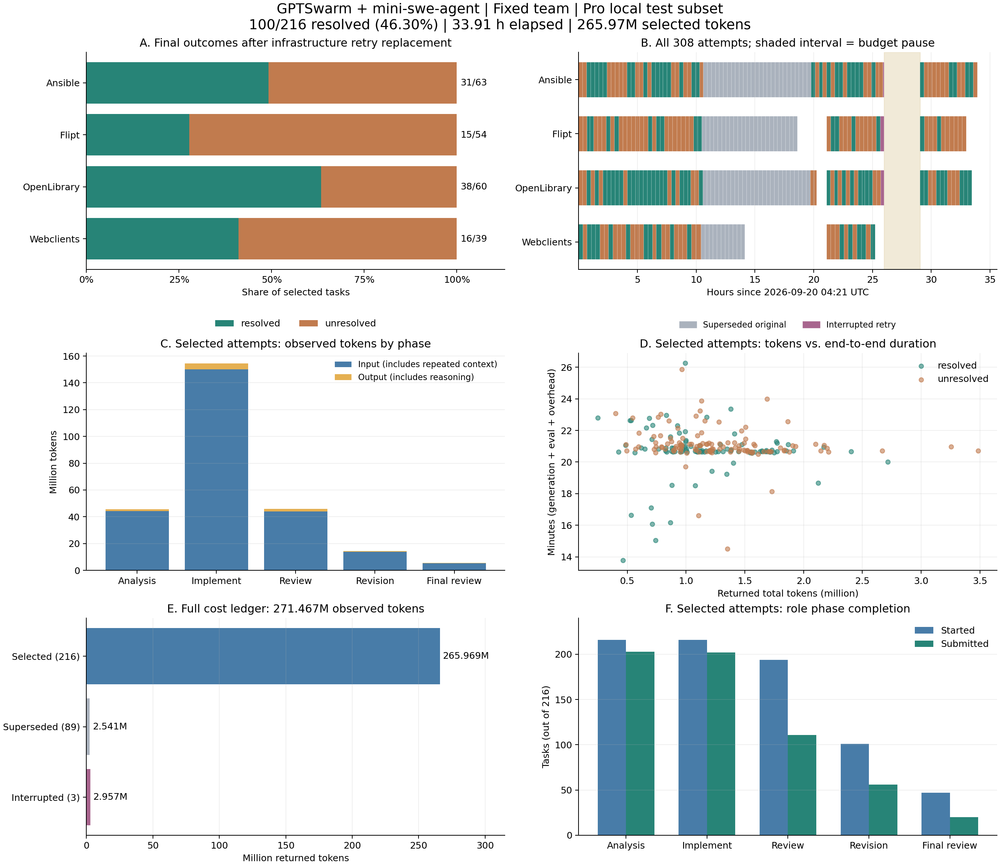

# GPTSwarm＋mini-swe-agent：SWE-bench Pro 固定团队实验报告

报告生成时间：2026-09-22T01:31:15.001224+00:00。原始批次 `mini_pro_full_20260920_domains_v2`，额度异常补跑批次 `mini_pro_retry_20260921_budget_v1`。

本地 SWE-bench Pro **test 划分 216 题**，按预先记录的基础设施补跑替换规则合并后，解决 **100/216（46.30%）**；未解决 116 题，无空补丁。汇总 error_ids 为 0，但详细评估中有 1 题网络基础设施失败、共 14 题无逐项测试结果，均已按未解决保留在分母。此成绩属于本地四域子集及本项目 Pro 评估适配，不是完整公开 Pro 数据集或一次无故障运行的成绩。

整个实验历时 **33.914 小时**，其中暂停等待额度 **3.075 小时**。最终采用的 216 次尝试记录 **265,968,885 tokens**；包含故障废弃尝试在内的全部 308 次尝试记录 **271,466,895 tokens**。



## 1. 实验范围与配置

- 数据来自既有 `swebench_pro_split.json` 的 `families.*.test`：Ansible 63、Flipt 54、OpenLibrary 60、Webclients 39。smoke/opt、预检、评估器对照和先前试跑均不进入正式成绩分母，也不复用其他框架预测。
- 保留原生 Swarm / CompositeGraph / Graph / Node 协作结构，固定节点和边，不运行优化。三种逻辑角色 Analyst、Engineer、Reviewer 均由 mini-swe-agent 实现，角色提示词、权限和交接内容不同。
- 五阶段：分析 → 实现 → 初审 → 返工 → 最终复核，每阶段新建 mini worker；Engineer 两阶段接续同一可写工作区，Analyst 使用干净副本，Reviewer 使用候选补丁副本及独立基线。最多一轮返工；初审批准且补丁未变时可合法跳过后两阶段。最终从真实工作区导出补丁。
- mini-swe-agent 2.4.6（冻结实际依赖源码和本地适配）、Python 3.11.15、swebench 5.0.2；模型 `DeepSeek-V4-Flash-0731`，temperature=0.2。
- 每题共享生成预算 1,200 秒，含环境准备；阶段建议时间 240/420/240/180/120 秒，step 上限 30/80/35/40/20。单次输出上限 16,384 tokens、API timeout 300 秒、命令 timeout 120 秒、report 预算 60 秒。阶段建议时间不是独立硬配额。
- 评估测试 timeout 1,800 秒；整题子进程保护 timeout 3,600 秒。四域并行、域内逐题生成后评估；补跑 Ansible 等待原域队列结束。API 内部重试启用。
- 模型可见题目及公开 requirements/interface，不提供 gold patch、test patch、隐藏测试名或准备命令。生成镜像位于 `/app`，保留工具链 PATH 和已安装依赖；恢复精确基线并清除主仓库及子模块的其他 Git 历史。
- 生成、基线检查、评审及评估容器均 `network=none`，模型 API 由宿主调用。

## 2. 评估协议与结果

采用 SWE-bench 5.x harness 加本项目 Pro TestSpec 与 Python/Go/Jest 日志解析适配，并非 stock Verified 评估入口。补丁应用后仅恢复指定测试文件，避免整仓 reset/checkout 擦除候选修改；隐藏测试准备失败不得算通过，Jest 使用镜像内工具且缺失测试不得算通过。Reviewer approval 和本地 check 结果不作为最终解题成功依据。

| 仓库域 | 题数 | 解决 | 未解决 | 解决率 | 额度补跑题数 |
|---|---:|---:|---:|---:|---:|
| ansible/ansible | 63 | 31 | 32 | 49.21% | 27 |
| flipt-io/flipt | 54 | 15 | 39 | 27.78% | 24 |
| internetarchive/openlibrary | 60 | 38 | 22 | 63.33% | 27 |
| protonmail/webclients | 39 | 16 | 23 | 41.03% | 11 |
| **总计** | **216** | **100** | **116** | **46.30%** | **89** |

216 份汇总结果、详细报告与最终选中尝试及状态文件一致，无报告缺失。其中 202 份含 tests_status，另外 14 份未进入逐项结果判定。详细报告的 patch_successfully_applied 字段只有 202 份为 true；该字段同时依赖有效测试日志，不能把 false 直接解释成 git apply 失败。14 题的 run_instance.log 均记录了 Applied Patch。

**需要单独标出的评估问题：**

- Flipt 10 题：日志出现 Go build/setup failed，未形成逐项测试结果。编译/依赖失败是否由候选修改引入仍需逐题核对基线，不能只按字段判为补丁应用失败。
- Webclients 3 题：日志有开始/结束标记及 wrapper 调用，但没有可解析的逐项测试结果。实际 Jest 子进程及输出采集原因尚未确定，不能归为已完成正常测试后的失败。
- OpenLibrary 1 题：详细报告 infra_failure=true、reason=network_unreachable；测试收集时尝试下载外部 schema，容器断网后域名解析失败。必须保留断网约束，后续应验证离线镜像依赖或 fixture 是否完整，不能据此判断补丁正确与否。
- 评估封装只要取得详细 report.json 且 resolved=false 就写入 unresolved，因此 error_ids=0 **不表示没有基础设施异常**。本报告不改变原评分，也不删除这些题；见 [14 题逐项清单](evaluation_exceptions.csv)。

## 3. 额度故障、补跑与确定性合并

| 口径 | 题/尝试数 | 解决 | 未解决 | 空补丁 | 中断 |
|---|---:|---:|---:|---:|---:|
| 原始批次 | 216 | 61 | 70 | 85 | 0 |
| 补跑全部尝试 | 92 | 39 | 50 | 0 | 3 |
| 最终选中 | 216 | 100 | 116 | 0 | 0 |

- 原批次 216 题完成后为 61 解决、70 未解决、85 空补丁。根据原始日志明确的 `Budget has been exceeded` 标记选出 89 题（85 空补丁＋4 未解决）；仅有普通 RateLimitError、随后成功重试的题不因此入选。选择证据在冻结的 `selection.json` 中。
- 补跑第一次完成 51 题后再次因硬额度错误暂停，3 题正在执行而被中断、35 题尚未启动。额度恢复后保留已完成的 51 题，重新执行这 38 题，最终 89 题得到 39 解决、50 未解决；86 题各 1 次尝试，3 题各 2 次，共 92 次补跑尝试。
- **全部 89 个入选 ID 一律使用最后完成的补跑结果，无论好坏；其余 127 题保留原结果。** 不从多次尝试中挑最好补丁，不将旧轨迹、旧补丁或评估反馈提供给补跑模型。原始记录保留原样。
- 补跑与原批的数据记录、镜像 ID、agent/prompt/评估器冻结源码及配置一致；仅数据子集与调度器文件不同。调度器增加域队列等待和明确额度耗尽时暂停保护。
- 最终 100 个成功由原批保留的 61 个和补跑的 39 个构成。分数变化包含服务恢复与新模型采样的影响，不能称为算法改进收益。

## 4. 运行时间

| 时间点/跨度（UTC） | 数值 |
|---|---|
| 原批开始 → 结束 | 2026-09-20T04:21:06.859881+00:00 → 2026-09-21T01:48:26.903474+00:00 |
| 补跑首次开始 | 2026-09-21T01:26:59.968682+00:00 |
| 补跑暂停 → 恢复 | 2026-09-21T06:19:15.696540+00:00 → 2026-09-21T09:23:45.736473+00:00 |
| 补跑最终结束 | 2026-09-21T14:15:56.085222+00:00 |
| 原批墙钟跨度 | 21.456 小时 |
| 补跑墙钟跨度（含暂停） | 12.816 小时 |
| **整个实验墙钟跨度** | **33.914 小时** |
| 暂停等待额度 | 3.075 小时 |
| 合并调度器活动区间（排除暂停、消除重叠） | 30.839 小时 |
| 最终选中尝试累计端到端时间 | 75.235 任务小时 |
| 全部尝试累计端到端时间 | 106.090 任务小时 |

补跑 status.json 的 started 在恢复时被覆盖，因此首次开始和暂停时刻取恢复前快照。原批与补跑部分重叠，两批跨度不可直接相加。调度器活动区间仍含排队、工具、eval 等等待，不是模型持续运算时长；任务小时也不是 CPU/GPU 时长。

| 时间口径 | 均值（分） | 中位数（分） | P90（分） | P95（分） | 最大值（分） |
|---|---:|---:|---:|---:|---:|
| 最终选中逐题端到端 | 20.90 | 20.84 | 22.32 | 22.84 | 26.27 |
| 选中生成轨迹跨度 | 19.84 | 20.09 | 20.15 | 20.20 | 20.36 |
| 选中剩余评估及进程开销（估算） | 1.06 | 0.74 | 2.19 | 2.74 | 5.97 |
| 全部尝试端到端 | 20.67 | 20.67 | 21.81 | 22.64 | 26.27 |

端到端来自调度器 started/finished；生成轨迹跨度取最后 runtime 事件的 monotonic elapsed。两者差值包含启动、导出、清理和评估，**不能解释为纯 eval 测试耗时**。中断尝试不统计这一差值。分位数使用线性插值。

| 域 | 平均选中端到端（分/题） | 平均 token/题 | 选中 tokens（百万） | 全部尝试 tokens（百万） |
|---|---:|---:|---:|---:|
| ansible/ansible | 20.56 | 1,493,355 | 94.081 | 95.131 |
| flipt-io/flipt | 21.09 | 1,152,587 | 62.240 | 63.934 |
| internetarchive/openlibrary | 20.12 | 1,202,852 | 72.171 | 74.265 |
| protonmail/webclients | 22.38 | 960,941 | 37.477 | 38.136 |

## 5. Token 消耗：选中成绩与全部成本

| 指标 | 最终选中 216 次 | 全部 308 次尝试 |
|---|---:|---:|
| 输入 prompt tokens | 257,589,529 | 262,897,748 |
| 输出 completion tokens | 8,379,356 | 8,569,147 |
| **总 tokens** | 265,968,885 | 271,466,895 |
| 其中 reasoning tokens（含于输出） | 4,235,940 | 4,337,970 |
| 其中 cached tokens（含于输入） | 228,723,968 | 233,447,424 |

| 成本组成（互斥，可相加） | 次数 | 总 tokens | 累计任务小时 |
|---|---:|---:|---:|
| 最终选中 | 216 | 265,968,885 | 75.235 |
| 被替换的原批故障尝试 | 89 | 2,540,602 | 30.179 |
| 补跑被中断的尝试 | 3 | 2,957,408 | 0.676 |

- 最终选中：平均每题 1,231,337 tokens，中位数 1,134,436；P90 1,787,878、P95 2,106,167、最大 3,485,957。
- 包含失败题的成功摊销：选中用量 / 100 = 2,659,689 tokens/解决题；全部尝试用量 / 100 = 2,714,669 tokens/解决题。
- 全部尝试 cached/input = 88.80%，reasoning/output = 50.62%。
- 全部 13,290 个返回响应中，基础 usage 缺失 0 个，reasoning 字段覆盖 13,290 个、cached 字段覆盖 13,290 个。
- 恢复前 API 探针另外记录 105 tokens，不计入任务尝试；只把这项已知探针加上时为 271,467,000 tokens，仍不等于账户完整账单。

用量仅逐行累计 events.jsonl 中 model_response.usage，不重复累加 trace/result。每次请求重发历史上下文按接口用量计入；reasoning 是 completion 子集，cached 是 prompt 子集，均不能再加进 total。失败/超时/取消请求可能已在服务端消耗 token 却未返回 usage，故这里是**可观测返回用量**；不含早期开发调试或未记录探针，不推算货币费用。

| 最终结果组 | 题数 | 平均 token/题 | 中位数 token/题 | 平均端到端（分） |
|---|---:|---:|---:|---:|
| resolved | 100 | 1,179,167 | 1,094,166 | 20.66 |
| unresolved | 116 | 1,276,312 | 1,187,139 | 21.10 |

## 6. 角色轨迹、耗时与完成情况

以下均以最终选中 216 次尝试为口径；全部尝试的阶段明细另附。

| 阶段 | 实际启动 | Submitted | 合法跳过 | 平均配对耗时（秒） | 输入 tokens | 输出 tokens | reasoning tokens | 总 token 占比 |
|---|---:|---:|---:|---:|---:|---:|---:|---:|
| 分析 | 216 | 203 | 0 | 293.8（n=216） | 44,111,419 | 1,551,404 | 661,202 | 17.17% |
| 实现 | 216 | 202 | 0 | 567.9（n=216） | 150,189,384 | 4,249,986 | 2,395,657 | 58.07% |
| 初审 | 194 | 111 | 0 | 250.5（n=194） | 44,077,973 | 1,886,050 | 907,247 | 17.28% |
| 返工 | 101 | 56 | 3 | 114.4（n=101） | 13,847,456 | 508,816 | 208,487 | 5.40% |
| 最终复核 | 47 | 20 | 3 | 87.0（n=47） | 5,363,297 | 183,100 | 63,347 | 2.09% |

阶段耗时仅统计成对 phase_started/phase_finished，含 worker 和结果处理；未启动阶段不按 0 秒混入平均值。三种逻辑角色对应五个阶段，并非五名独立成员。

全部阶段 Submitted 或合法跳过的题有 **22/216**，另 **194** 题至少一个阶段未正常完成。最终复核启动 47 次、正常提交 20 次。完整流程中解决 15 题，未完整流程中解决 85 题；角色异常不等于最终补丁失败。

| 阶段退出状态 | 次数 |
|---|---:|
| Submitted | 592 |
| TaskBudgetExhausted | 2 |
| BudgetExhausted | 285 |
| SkippedApproved | 6 |
| PhaseTimeout | 151 |
| LimitsExceeded | 2 |
| ReadOnlyViolation | 26 |
| RateLimitError | 1 |
| PhaseError | 15 |

可比的 216 题中，208 题最终补丁与实现阶段补丁逐字节相同。审查未改补丁不能据此认定无价值，发生修改也不能证明收益。难度、用时和完成度相互关联，没有对照不能从这些分组作因果判断。

## 7. API 稳定性与预算影响

| 指标 | 最终选中 | 全部尝试 |
|---|---:|---:|
| 模型请求尝试 | 15,964 | 20,424 |
| 返回响应 | 12,975 | 13,290 |
| API 错误 | 2,964 | 7,107 |
| 末尾未收到响应/错误的请求 | 25 | 27 |
| 至少一次 API 错误的尝试 | 202 | 294 |
| 至少一次 RateLimitError 的尝试 | 186 | 278 |
| 非空 reasoning_content 响应 | 11,882 | 12,156 |
| finish_reason=length | 1 | 1 |

| API 错误类型 | 最终选中 | 全部尝试 |
|---|---:|---:|
| BadGatewayError | 75 | 92 |
| RateLimitError | 2784 | 6906 |
| Timeout | 105 | 109 |

全部尝试的成功请求配对等待累计 50.192 小时，失败请求等待 6.083 小时，错误返回到下一次请求的间隔 29.968 小时。均为跨任务相加，重试间隔含客户端处理；未结束请求等待不在配对计时内。请求数逐阶段核对为响应＋错误＋未结束请求，不含 SDK 内部不可见重试。

最终选中尝试均未出现明确额度耗尽标记；全部尝试中 90 次有该标记。硬额度错误以日志文本与选择审计判定，不能仅从 RateLimitError 类名推断。其余限流、超时、工具运行仍消耗共享 1,200 秒，会压缩返工和复核窗口。记录中存在 reasoning 内容及 usage，不支持“模型没有思考”的结论；这些计数也不能证明思路正确。

## 8. 隔离、复现与结论边界

- 原批生成镜像预检 216/216，通过后补跑复用一致镜像的 89 条证据。初始扫描发现的 42 条镜像构建差异经定向复检修复：32 条 Go go.work.sum、3 条 OpenLibrary 测试初始化、7 条 Webclients sandbox.js。保留安装依赖，只恢复允许的构建改动。
- 每域一题 gold patch 应通过、base patch 应失败，8/8 评估器对照符合预期。对照与预检不调用模型、不计入正式成绩。8 条对照只验证抽样通路，不等于已证明 216 题的解析器和测试集合完全无误。
- 最终选中记录生成网络检查 940 条、eval 检查 216 条；全部尝试分别 1478 和 220 条，全部 network=none。次数为轨迹检查记录，不等同于去重后的物理容器数。
- 原批和补跑 manifest 冻结文件逐项 SHA-256 核对无差异，实际 worker mini 依赖 hash 与冻结副本一致；选中结果与详细 eval 记录一致，事件解析和请求/用量守恒检查无异常。其他 Python 依赖未完整封装为可移植环境。
- 数据仅为本地四域 test 子集。与此前 Verified 154 题的任务/仓库/评估不同，两个解决率不能直接用于衡量能力升降。
- 本实验没有同预算单 mini、不同随机种子或启用边优化的对照；只能作为固定多角色架构基线，不能证明协作增益或演进有效。
- 既有只读角色协议仍有暂时修改后恢复的检测限制，本地检查输出分类也可能误判；这些与共享预算挤占应继续结合逐题轨迹分析。未解决 116 题不能一概归为模型能力不足或基础设施问题。

后续应另起冻结批次：先按需求理解、修改遗漏、回归、工具/协议异常分组分析失败，再在同一任务集、模型和预算下运行单 mini 与固定团队对照。当前报告保留故障、补跑成本和原始评估结论，不用新试跑覆盖。

## 9. 附件与复现

- [结构化汇总](summary.json)：配置、双口径成本、域/阶段结果、时间及审计。
- [逐题明细](per_task.csv)：最终选中 216 行；[逐阶段明细](per_phase.csv)：1080 行。
- [全部尝试](per_attempt.csv)：308 行；[全部尝试阶段](per_attempt_phase.csv)：1540 行，包含被替换和中断的开销。
- [结果选择映射](selection.csv)：逐题原结果、替换理由、最终来源与结果。
- [评估异常明细](evaluation_exceptions.csv)：缺少逐项测试结果的 14 题、原始标记和日志分类，不含隐藏测试内容。
- [统计输入 SHA-256](source_hashes.json)：路径以批次目录名开头，文件位于本机 outputs/swebench/ 下；不附原始日志、模型轨迹、数据集隐藏字段或密钥。
- [统计脚本](summarize_mini_pro_report.py)；[绘图脚本](plot_mini_pro_report.py)；图表 [SVG](experiment_overview.svg) / [PDF](experiment_overview.pdf) / [PNG](experiment_overview.png)。
- [附件清单与 SHA-256](artifact_manifest.json)。统计只读原始批次，不请求模型、不重跑 eval；绘图只需报告附件及 matplotlib。

在 GPTSwarm 项目根目录执行：

```bash
python scripts/summarize_mini_pro_report.py \
  outputs/swebench/mini_pro_full_20260920_domains_v2 \
  outputs/swebench/mini_pro_retry_20260921_budget_v1 \
  --output-dir docs/experiments/mini_pro_20260920
python scripts/plot_mini_pro_report.py docs/experiments/mini_pro_20260920
```

统计脚本也可使用本目录副本，输入两批原始目录可整体搬迁。暂停时间依赖补跑目录中的 status_before_resume 快照；不可只用恢复后的 started。CSV 中空白 residual 表示中断未形成完整评估跨度，空白阶段耗时表示无成对事件，并非 0 秒。
