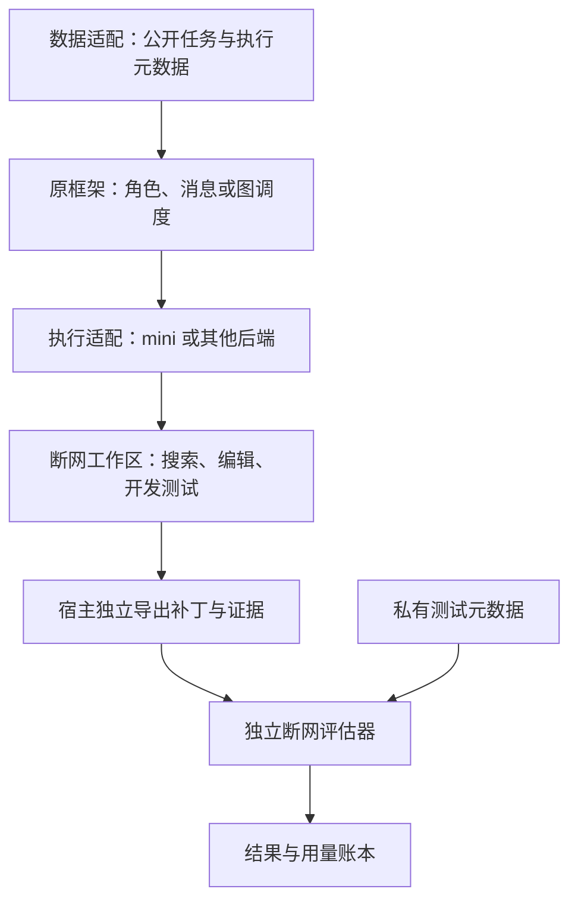

# SWE 实验跨框架适配指南：EvoMAS、MetaGPT 与 GPTSwarm

编写日期：2026-09-21。适用目标：把已有 agent / 多 agent 框架接入 SWE-bench 或 SWE-bench Pro，先得到可信、可复现的固定框架基线，再研究协作或演进收益。

本文依据三个本地项目的代码、历史报告与运行记录整理。**“已实现”指相应项目的特定实现，不代表三个框架都已具备；“静态风险”指代码审计发现，不等于已证明所有历史运行受影响；“建议”是迁移目标，不是已经验证的优化收益。** 代码与文档冲突时，优先核对该批次冻结源码和实际请求。来源见第 15 节及配套 [源码快照清单](swe_cross_framework_sources.json)。

## 1. 先抓住五个决定迁移成败的要点

1. **复用成熟编码循环，保留目标框架的协作机制。** mini-swe-agent 可以承担搜索、编辑、测试、再修改的执行循环；角色路由、图结构、审查和返工仍由目标框架负责。
2. **提交物是容器里的真实代码修改。** 模型说“完成”、输出一段 diff、Reviewer 批准，都不等于成功提交，更不等于独立评估通过。
3. **先排除工程故障，再判断能力。** 空补丁可能来自 API 预算耗尽、消息未进入模型、工作目录错误、采集失败或确实没改代码，不能统一归结为 agent 弱。
4. **同模型、同 mini、同题数仍不足以公平比较。** 公开输入、时间口径、总调用预算、镜像基线、评分解析、重跑选择规则都可能不同。
5. **批跑必须具备暂停和恢复闭环。** 瞬时限流重试，预算耗尽暂停；恢复后探测 API、显式续跑。无人值守状态应清楚区分“运行、等待、暂停、结束”。

如果只想尽快迁移，先按第 12 节的阶段验收表推进；遇到失败查第 13 节。不要从复制一个“大而全”的团队 YAML 开始。

## 2. SWE 任务与普通问答的差别决定了适配方式

| SWE 的特点 | 对运行系统的要求 | 典型错误 |
|---|---|---|
| 输入是 issue 与指定版本仓库 | 确认 instance ID、base commit、容器工作目录和公开字段 | 在镜像构建 HEAD 或宿主机另一个 checkout 上修改 |
| 正确答案不是唯一文本 | 用代码行为和独立测试评分；不要与 gold patch 做文本相似度判断 | 把更像参考 diff 当成更正确 |
| 修改会改变后续环境 | 工作树、补丁、测试证据都绑定版本摘要 | Reviewer 看的是旧补丁、用的是新测试输出 |
| 需要反复定位、编辑与执行 | 允许重新读源码、调整定位、运行工具并修复 | 定位一次后，只在截断 diff 中反复生成 SEARCH/REPLACE |
| 依赖、语言、测试入口各异 | 镜像与工具链适配独立于 agent 框架 | 把 Python/conda 假设带到 Go、JS、BusyBox 镜像 |
| 隐藏评估与公开开发检查不同 | 分离生成与 eval，保留失败证据但不回填隐藏答案 | 看过隐藏测试后针对该题改提示词并计入正式成绩 |
| 单题可能持续约 20 分钟 | 统一 deadline、输出预算、取消及补丁回收 | 45 秒角色上限先切断思考；外层超时却不终止容器子进程 |
| 运行成本由整个队列累积 | 记录返回 usage、重试、失败与全账户预算事件 | 一次请求成功就认定全量额度充足 |

**开发测试通过、补丁可应用、独立 eval 通过，应分别记录。** 旧测试失败可能说明新需求改变了行为，也可能是真回归；必须解释，不能自动忽略。反过来，自己写的断言可能和错误假设一致，全部通过仍然解错题。

### 2.1 数据集不是只替换一个 JSON 文件

以下是本机实验约定，不是所有 SWE 镜像的通用规范：

| 项目 | Verified 子集 | Pro 子集 |
|---|---|---|
| 规模 | 154：Django 59、Matplotlib 23、Sphinx 33、SymPy 39 | 216：Ansible 63、Flipt 54、OpenLibrary 60、Webclients 39 |
| 代码目录 | `/testbed` | `/app` |
| 镜像解析 | instance ID 转换后查找生成/评估标签 | `jefzda/sweap-images:<dockerhub_tag[:128]>` |
| 公开输入 | GPTSwarm 当前协议仅 `problem_statement` | 题目＋公开 `requirements`、`interface` |
| 语言与测试 | 本批为 Python | Python / Go / JS，pytest / go test / Jest |
| GPTSwarm eval | 原环境 swebench 2.1.6，含本地兼容钩子 | 独立 Python 3.11 环境中的 swebench 5.0.2＋Pro TestSpec/解析器 |

Pro 的 216 条来自既定划分的 `families.*.test`，不是公开 Pro 全部 731 条。转换数据时保留 ID，不把 smoke/opt 混入 test；记录原始数据、split 和转换结果的 SHA-256。不要只拿旧项目已经拼好的 `query`：它可能丢了 Pro 的公开接口说明，也可能加入了另一个实验协议允许的 hints 或测试名。

建议把数据分成三层，而不是把整条数据记录直接序列化进提示词：

| 数据层 | 例子 | 可见范围 |
|---|---|---|
| 公开任务 | issue、公开 requirements/interface | 模型 |
| 执行元数据 | instance ID、repo、base commit、镜像标识、工作目录 | 宿主调度与运行器；按需提供非敏感项 |
| 私有评估材料 | gold patch、test patch、F2P/P2P 列表、隐藏测试准备命令 | 宿主评估端，不挂载进生成容器 |

任务原文已经公开提到某个测试，不需要机械删去；禁止的是额外从评估元数据补充隐藏信息。若专门研究 test-aware agent，可以定义另一组协议，但所有对照必须同样可见，并明确标注。

## 3. 三个框架应该保留什么、替换什么

### 3.1 实际架构比较

| 维度 | EvoMAS | MetaGPT＋mini | GPTSwarm＋mini |
|---|---|---|---|
| 框架核心 | YAML 配置、AgentSpec、DAG runtime、拓扑/配置演进 | Team、角色消息、共享任务状态、提交与返工生命周期 | Swarm → CompositeGraph → Graph → Node |
| 本文参考的固定基线 | ChatDev 风格 CEO → CTO → Programmer | Leader → Engineer → Reviewer，按反馈返工 | Analyst → Engineer → Reviewer → Engineer 返工 → Reviewer 复核 |
| 编码后端 | 可选 mini、SWE-agent、smolagents；当前 ChatDev YAML 三角色均为 mini DefaultAgent | Engineer 使用安装的 mini DefaultAgent；Leader/Reviewer 为 MetaGPT SWE 专用工具循环 | 三个逻辑角色均用 mini DefaultAgent，不同提示词、上下文和工作区权限 |
| 状态传递 | Context 与前驱报告；各 runner 的文件状态语义需另查 | 持久交接、提交编号、补丁摘要、检查记录、反馈 | 原生消息边、结构化 handoff、补丁摘要、检查记录 |
| 文件状态 | mini runner 每次创建环境；文本报告不自动等于补丁接力 | 团队共享一个任务工作树 | Engineer 使用主工作树；分析/审查使用隔离快照，审查另有基线容器 |
| 关闭演进后 | 固定 YAML，不调用配置搜索/更新 | 固定角色与预算 | `edge_optimize=False`、`node_optimize=False`，仍要显式建立通信边 |
| 最应迁移的部分 | backend 抽象、任务/镜像绑定、生成与评估解耦 | 显式提交协议、持久消息、预算阶段、独立采集 | 固定原生图、角色证据协议、冻结批次、断网与历史隔离 |

mini 是执行器，不是模型。三个项目都可以使用相同模型和 mini 实现，但仍具有不同的协作机制。smolagents 也是独立的开源执行框架，EvoMAS 从它导入 `CodeAgent` / `ToolCallingAgent`；它不是 mini 的另一层名字。EvoMAS 的 `agent_type`、agent 级 backend 与 MAS 级 backend 有选择优先级，迁移时应记录实际解析出的 runner。

**这是合理的控制变量方案，不是“用了 mini 就自动满足某种统一标准”。** 报告应命名为“框架＋SWE 适配＋mini 后端”，说明替换范围；不能把经过专项改造的系统称为完全原版框架。

### 3.2 相同实现不妨碍多角色，但角色必须真正发生作用

角色至少应在以下方面形成可观察差异：

- 目标与交付物：分析定位事实，编码提交工作树，审查给出有证据的结论。
- 信息：初审是否先独立建立标准，复核是否继承前轮发现。
- 权限：哪些角色可写主工作树，哪些只检查快照。
- 调度：谁触发谁、谁能要求返工、何时停止。
- 消费证据：后继实际模型请求是否包含前驱交接，而非只在消息总线里出现。

EvoMAS 当前 mini runner 的静态审计还发现：`create_agent` 没有显式把 `AgentSpec.prompt/max_tokens/temperature` 逐项传给模型/角色模板；它主要加载公共 mini 配置、模型 ID，并对 CEO/CTO 设置步数。**不能仅凭 YAML 中字段不同就宣称提示词与预算已生效。** 应采集实际 API 参数与系统提示来验收；这不是对所有历史安装版本的统一判断。

### 3.3 不要把集成、协作和演进混成一个实验

| 实验类型 | 最低可观察证据 | 能回答的问题 |
|---|---|---|
| 独立候选集成 | 多个独立补丁＋明确选择规则 | 多次采样和选择有没有收益 |
| 固定多角色协作 | 消息进入后继模型、共享/传递代码状态、有反馈消费 | 分工与交接机制能否工作，可能产生何种收益 |
| 演进/拓扑优化 | 在独立 opt 集上学习配置，冻结后测 test | 搜索后的组织结构是否改善结果 |

GPTSwarm 早期“三个相同 agent 独立执行＋补丁字符串投票＋平票随机选”曾丢弃本地验证证据；这能测试集成，却不充分测试用户希望验证的协作。关闭边优化也不会自动产生合理的固定协作图。当前实现显式连边，并只把初始任务注入根节点，防止直接输入遮蔽前驱消息。

## 4. 历史结果能提供什么证据

| 证据 | 可以支持 | 不能直接推出 |
|---|---|---|
| EvoMAS 历史报告记载 Verified 106/154、Pro 65/216 | 成熟执行器、容器与独立测试链路值得借鉴 | 比另外两个框架更强；报告明确包含额外测试名输入，Pro 还有原版/重跑取最优，token 覆盖也不同 |
| MetaGPT pro7 原始 3/3 因读取未来 Git 历史作废；隔离后的 pro8/pro9 为 2/3 | 断网仍需移除未来 Git 对象；执行恢复能产生可评估补丁 | 三题足以证明全量收益；增加预算必然提高准确率 |
| GPTSwarm Verified 冻结批次 102/154，22.20 小时，206,801,947 返回 tokens | 固定团队全量链路可运行；时间、token、异常可审计 | 完整 Verified 成绩；相对单 mini 的因果提升 |
| GPTSwarm 同批 129/154 至少一个角色非正常结束，最终复核仅 26/154 正常提交 | “任务有补丁”和“协作完整执行”必须分开量化 | 所有失败都是模型能力不足；完整流程组更好就是协作导致 |
| GPTSwarm Pro 原批 89 条遇到明确 API 预算耗尽，其中 85 空补丁 | API 故障会系统性污染结果，应暂停并另批补跑 | 这些空补丁反映编码能力；将它们从分母删除就得到最终得分 |

EvoMAS 的 Pro 报告还描述了“空补丁通过”与后续剔除现象。当前 Pro 解析代码存在裸文件测试条目无匹配时判通过的分支，因此不能仅凭这份历史报告断言一定是数据集质量问题；需要先检查测试确实执行、条目确实匹配，再判断基线是否已经满足目标。

这些数字用于说明工程问题与证据边界。本文不对三个框架排名，也不将仍在补跑的 GPTSwarm Pro 成绩写成最终结果。[E2][M2][G2][G3]

## 5. 可迁移的最小底座与接口契约

建议把适配分成六层，每层能独立验收：



只让最后一层反馈正式分数；生成中的 Reviewer 不接触隐藏评估。用于架构搜索的反馈只能来自声明的 opt 集，不能用 test 评估反复指导配置选择。

下面是**推荐的通用接口，不是声称三个项目已经共用这些字段**：

```text
PublicTask: instance_id, problem_statement, public_requirements, public_interface
WorkspaceSpec: image_id, base_commit, cwd, shell_env, network_mode
Budget: task_deadline, phase_target, api_timeout, max_output_tokens, step_limit
Handoff: phase, facts, hypotheses, unknowns, acceptance_criteria, evidence_ids
PatchArtifact: base_commit, patch_sha256, patch_path, excluded_paths, export_status
CheckEvidence: command, exit_code, tests_seen, classification, tree_digest, log_path
RoleResult: exit_status, handoff, patch_digest, checks, usage_event_refs
EvalResult: patch_apply_status, test_setup_status, tests_matched, outcome, report_path
```

实现原则：公开输入使用白名单；工作树由明确的 owner 管理；导出失败不返回空字符串冒充正常提交；Reviewer 结论不直接写入 `resolved`；API usage 只在一处记账，其他层引用事件 ID。

## 6. 环境适配：先把正确的仓库交给 agent

### 6.1 分开宿主、worker 和目标项目依赖

MetaGPT 主环境与 mini 的 Python 版本不同；GPTSwarm 主环境也与 mini/Pro eval 环境不同。当前采用独立 worker 进程，避免为接入 mini 而升级整个框架的依赖树。

迁移时记录四份信息：框架解释器、worker 解释器、eval 解释器、容器内工具链。可先分离 worker/eval，必要时再统一；不要把 `import 一个辅助函数` 写成会初始化整个框架的依赖入口。

mini 的版本号不能替代源码：本机安装包包含适配的可能性已在历史文档中说明，GPTSwarm 正式批次会复制实际安装包并记录摘要。复制 runner 却遗漏修改过的 site-packages，会得到“版本相同、行为不同”的系统。

### 6.2 每个镜像都检查基线，不能只检查一个成功样本

生成容器启动后，至少检查：

1. 实际网络为 `none`，没有另接其他网络。
2. 工作目录正确，Git HEAD 最终等于数据集 base commit。
3. 已跟踪文件与暂存区符合选定的基线策略。
4. 工具链存在，初始化环境一致。
5. Git 历史隔离后，子模块和已安装依赖仍可使用。
6. 尚未运行模型时，导出补丁为空；或者镜像初始差异已单独标记，不能归给 agent。

GPTSwarm Verified 曾遇到 SymPy 镜像批量 chmod、Sphinx 构建提交修改 `tox.ini`。Pro 全量首轮预检又发现 42 个镜像有额外构建差异：32 个 Flipt 的 `go.work.sum`、3 个 OpenLibrary 的测试初始化兼容改动、7 个 Webclients 的构建产物。仅每域抽一题没有覆盖这些问题；最终通过全量检查与定向复检关闭缺口。[G3]

### 6.3 两种镜像脏工作区策略不能混用

| 策略 | 本地实例 | 优点与代价 | 验收重点 |
|---|---|---|---|
| 恢复精确任务基线 | GPTSwarm：还原已识别构建改动，再校验干净工作树 | 补丁含义直接；还原 requirements/锁文件后仍需确认已装依赖可用 | HEAD、tracked diff、cached diff、初始空补丁、真实工具调用 |
| 保留镜像兼容修复，过滤未变的初始文件 diff | MetaGPT：记录初始补丁，导出时剔除逐字相同的文件块 | 保留环境修复；agent 若又编辑同一文件，需保留完整 HEAD-relative diff，不能做字符串“减法” | 初始改动与 agent 改动的归属，以及独立 eval 能否应用 |

两种策略都必须先验证。不要对共享镜像或用户工作区盲目 `git reset --hard` / `git clean -fd`；恢复动作限定在本题的一次性容器。不要把预装依赖目录删掉，也不要因目录名像测试就删除所需 fixture。

### 6.4 断网之外还要防止本地答案泄漏

MetaGPT pro7 已经发生过从本地未来 Git 历史读取目标实现和测试的情况。仅删 remote、删 refs 或禁止 `git log` 不够：对象仍可能按 SHA 读取。

当前可复用方案是保留原 base SHA，建立只含该提交的浅对象库，移除旧对象库及其他 refs/reflogs。初始化过的子模块必须先从最深层转换为独立浅仓库，再替换主仓库 `.git`，否则指向 `.git/modules` 的 gitfile 会失效。建议复用已验证的 `isolate_history_command`，不要临时拼几条删除命令。

验收不能只看提交数：同时确认 base SHA、不依赖 alternates、无其他 refs、旧对象不可访问、子模块可读、依赖未被破坏。还要检查镜像是否留下 gold patch、答案文件或隐藏数据；断网和浅历史只是关闭已知路径，不是完全隔离的证明。

API 凭据保留在宿主 worker 环境即可。EvoMAS 当前 runner 有 `forward_env` 列出 API key 的路径，其子类容器启动实现又不同于上游，实际是否转发需检查；迁移时直接移除不必要的凭据转发比依赖“恰好没生效”可靠。不要打印完整 Docker inspect 环境变量进行检查。

## 7. 工具、补丁与取消：必须验收到实际提交

### 7.1 同一个容器，角色的 shell 也可能不同

MetaGPT 曾出现 mini 能找到 Go、Reviewer 找不到：`bash -c` 与 `bash -lc` 的 PATH 初始化不同。当前 MetaGPT 的 SWE shell 显式设置 `BASH_ENV`；GPTSwarm 的 Pro 分支则保留镜像 PATH，不统一套用 Verified 的 bashrc，Ansible 单独设 `PYTHONPATH=/app/lib`。

因此迁移的是“统一 shell 契约”，不是无条件复制某个环境变量。对每种镜像家族、每种角色工具、独立补丁采集入口都检查 `pwd`、`command -v`、失败退出码、超时和多行命令。

| 实际踩坑 | 实操修复 |
|---|---|
| Webclients 的 BusyBox 不接受 GNU timeout 长参数 | 使用已经跨镜像实测的 `timeout -k 2`；普通工具和补丁导出两条路径都要改 |
| heredoc 结束符后拼 `&& echo ...` 造成语法错误 | 原命令保持完整，退出码标记放独立新行；用真实多行脚本验收 |
| 持久 shell 被取消后，残留输出污染采集 | 用新的 `docker exec` 独立导出；检查执行状态 |
| `pytest ... | tail` 掩盖测试失败；`head` 导致 SIGPIPE | 先把完整输出写日志并保存退出码，再裁剪展示 |
| 超时只杀宿主 docker 客户端，容器子进程还在跑 | 同时设置容器内命令 timeout、宿主等待上限、任务进程组和容器标签清理 |

不要假设所有镜像超时都返回 124，BusyBox 等路径可能表现为 143。记录“由哪一层触发超时”，而不是仅凭退出码猜测。

### 7.2 独立导出实际工作树

补丁采集至少覆盖：已跟踪文件修改、删除、新建文件、暂存与未暂存修改、适用时的二进制与权限差异。`git diff HEAD` 本身不包含 untracked 新文件；模型输出的 diff 也可能与真实工作树不同。

GPTSwarm 使用临时 Git index，基于 HEAD 加入允许的 changed/new paths，再导出 `--binary` diff；不修改 agent 的真实暂存区。MetaGPT 使用独立 exec 收集暂存 diff，并处理初始兼容改动。复用这些实现时一并迁移测试路径过滤、传输文件排除和初始 untracked 基线。

推荐的生命周期：

```text
try:
    prepare_workspace()
    run_framework_until_deadline()
finally:
    export_actual_patch_with_independent_exec()
    save_patch_digest_and_export_status()
    save_role_exit_reasons_and_checks()
    cleanup_only_this_task_containers()
```

实际实现必须让采集失败可见，且即使采集异常仍能清理；不能因为用了 `finally` 就默认已经处理全部异常。对测试路径的限制也需按语言补齐，例如 `_test.go`、`.test.ts`、`.spec.tsx`。过滤候选测试文件不是不可绕过的权限沙箱。

**不要把“提前强制 submit”当成普遍解法。** EvoMAS 为抑制长时间探索加入了步数/命令文本启发式；当前正则也可能把只读 `sed` 当成编辑，强制返回发生在 usage 累计之前。更可靠的建议是监测真实工作树变化和公开任务进展，先保存交接、缩小探索范围；若修改调度策略，单独冻结并评估。

## 8. 协作契约：传递消息、工作树和可核对的证据

### 8.1 框架投递成功不等于模型看到消息

MetaGPT 曾有 Leader 消息触发 Engineer，却未进入编码模型请求。GPTSwarm 曾有直接输入覆盖前驱输入、初审披露内容未进入下一次请求、最终复核重复执行初审的延迟披露流程。

可操作的验收方法：

1. 在模拟模型测试中给前驱交接放唯一标记。
2. 检查后继**实际请求**确实包含它；不要只检查 `message_sent`。
3. 裁剪短期记忆后重测，确保关键计划和反馈仍持久保留。
4. 返工与最终复核分别检查，不能拿首次编码的成功代替整个循环。
5. 用真实 mini DefaultAgent＋模拟回复执行容器工具，验证协议；然后再做真实模型小样本。

### 8.2 分析要区分事实与假设，审查要保留不确定性

建议分析交接包含：确认的位置、复现观察、假设、计划、验证方式、未知项。路径只是猜测时明确标注。Reviewer 至少三态：

| 语义 | MetaGPT 当前名称 | GPTSwarm 当前名称 | 应采取的动作 |
|---|---|---|---|
| 有证据接受 | approved | approve | 保留补丁；正式得分仍由 eval 决定 |
| 有具体修改要求 | changes_requested | request_changes | 反馈关联文件、行为和证据；预算允许才返工 |
| 未完成判断/证据不足 | inconclusive | unverified | 保留现有补丁并注明，不制造“已通过”或无依据拒绝 |

不能把 Reviewer 超时自动当成需要返工，也不能把“未见失败”当成批准。结构化字段、说明文字和实际动作应一致；相同 digest 重复提交时，需要检查是否增加了新证据，否则可能只是消耗轮次。

### 8.3 证据必须绑定工作树版本

每次检查记录：命令、真实退出码、执行到的测试、完整日志位置、输出分类、代码摘要、角色与时间。后继能区分“旧版本曾失败”“基线也失败”“当前补丁失败”。保存关键失败证据，避免它被后续一串读文件动作挤出窗口。

GPTSwarm 采用初审先记录独立标准、再接收前驱报告的流程；最终复核则直接继承标准与返工信息。它可以减少一种锚定风险，但尚无单独实验能证明解决率提升。初审发现关键缺陷时，应及时写入 checkpoint，不能等最后一个请求才总结；固定图走到最终复核才发现问题，可能已经没有修复节点。

只读角色也要验证行为。提示词“不得修改”与阶段结束时 digest 相同，不等于过程中绝对只读：曾观察到 `stash/pop` 临时改树后复原。若需要强隔离，应设计权限或工作区沙箱，同时允许测试写缓存；不要一刀切把整个测试工作目录只读而使检查失效。

## 9. 预算：配置要传到模型，时间要留给后续角色

### 9.1 区分五种预算

| 预算 | 用途 | 检查方式 |
|---|---|---|
| 每次输出 token | 工具参数、回答及接口计入其中的 reasoning | 实际请求值、usage、finish_reason |
| 每次 API timeout | 一次请求最多等多久 | 请求记录与实测等待时间 |
| 角色/阶段预算 | 给规划、编码、审查分工留空间 | phase start/end、剩余时间及退出原因 |
| 整题生成 deadline | 限制整道题的生成工作量 | 同一单调时钟，涵盖哪些准备开销需明示 |
| 进程/eval 兜底 | 防止挂死、给独立评估留时间 | 与生成时间分别统计，不偷偷扩大解题额度 |

MetaGPT 曾写死协调角色输出上限 1,536，一次响应的 reasoning 就用完额度，工具调用还没形成。只调 Engineer 的参数没有作用。GPTSwarm 也经历过临近报告期时把请求缩到十几秒，以及剩余不足 45 秒就完全拒绝请求的问题；后来取消这个门槛。

**先看实际参数和 `finish_reason`，再判断是不是思考占满输出。** API 等待包含服务排队与传输，不能把整段耗时都称为思考时间；看到 reasoning 字段也不能证明推理方向正确。

### 9.2 当前两个团队的时间策略不同

| 策略 | 本地配置 | 已知权衡 |
|---|---|---|
| MetaGPT 分阶段预留 | 整题 20 分钟；Leader 180 秒；首次提交最迟第 12 分钟；初审至第 15、返工至第 17、复核至第 20 分钟 | 能保留后段机会，但阶段硬截止可能切断尚未完成的工作 |
| GPTSwarm 共享时间 | `task_seconds=1200`；阶段目标 240/420/240/180/120 秒仅作提示；API 上限 300 秒；最后约 5 秒留作回收 | 减少过早切断，但前段可以挤占复核；历史全量已观察到这一问题 |

两者的“20 分钟”也有边界差异：MetaGPT 文档的生成预算不含初始化/正式 eval；GPTSwarm runtime deadline 从环境准备前开始。比较前要统一或分别披露。

迁移起点可以采用每次输出 16,384、整题生成 1,200 秒，但这是本机经验值，**不是最佳参数结论**。建议先保持原框架预算策略做可运行基线，再比较硬预留、软目标或动态分配；不要同时换执行器、提示词和预算后只归因于框架。

## 10. 评估器：不只要“能运行”，还要判得对

生成环境中的公开开发检查与独立 eval 分开。eval 应从规定镜像/基线启动，应用实际预测补丁，再准备评估测试。测试准备命令不能把模型修改整仓 reset 掉，也不能把参考生产代码一并 checkout 回来。

Pro 当前不是把 Verified harness 的数据路径换一下即可：GPTSwarm 使用 MetaGPT Pro 协议的 TestSpec 与 Python/Go/Jest 解析器，在独立环境运行；报告应注明“swebench harness＋Pro 适配”。

### 10.1 每种评估协议至少做正反两个控制

| 控制 | 输入 | 期望与解释 |
|---|---|---|
| 正控制 | 标准补丁，仅在独立 host/eval 侧使用 | 应通过；不通过先查 patch apply、测试准备、依赖与解析 |
| 基线控制 | 不修改生产代码 | 应暴露目标缺陷；若通过，检查缺失测试、匹配规则、原基线状态，不能静默删题 |
| 缺失/错误控制 | 未找到目标测试、测试收集失败或命令超时 | 必须体现不完整/错误，不能视为通过 |

GPTSwarm Pro 启动前做了四域各一题、共八次正反控制，结果符合预期；这证明所测通路可用，不等于所有 216 题的解析语义已被完整证明。标准补丁控制不进入模型，也不计为模型成功。

### 10.2 已遇到的解析陷阱

- pytest 参数 ID 含空格、数据中的 ID 可能截断，不能按空格随意拆名字。若用前缀匹配，必须规定唯一性、失败优先与匹配数，不能无限放宽。
- Django 测试输出拼接曾让一个通过项漏认；同题另有真实负数语义失败，因此最终 unresolved 不变，但子项计数不能无条件照抄。
- Go 的包、父测试与子测试需要正确映射；`[no test files]`、`no tests to run` 不能由附近的 PASS 覆盖。
- Jest 的 package 相对路径、`describe` 层级和 fullName 会影响匹配。若去掉 suite 前缀，检查名称碰撞，不能让另一测试的 PASS 替代目标测试。
- 本地证据分类曾把 `80 passed, 1 exceptions` 判为通过，也未识别某种 `N assertions passed` 格式。分类器是辅助；需要退出码、真实测试数量和原始日志共同支持。
- EvoMAS 当前 Pro 脚本有“裸文件名没有匹配测试也返回 passed”的路径、Jest 选择入口和宽松名称匹配。这些是迁移前必须审计的静态风险，不应照搬为通用解析器。

环境里缺少项目自身应由补丁实现的私有符号，可能就是补丁没做对；不能都说成依赖不全。相反，测试命令根本没启动、测试准备失败、模块工具未安装，也不能算模型已经接受了有效评估。

## 11. 长时间批跑：从 API 异常到暂停、探测、续跑

### 11.1 用错误语义决策，不只看异常类

| 现象 | 建议策略 |
|---|---|
| 短时 429 / RPM / TPM / 并发限制 | 有界退避重试，必要时降低并发；等待计入所声明预算 |
| 明确 `Budget has been exceeded` / `insufficient_quota` | 暂停新任务，中断或保存当前尝试；保留待跑队列 |
| 401 / 402 / 凭据失效 | 停止相应请求路径，修复配置后探测；不能盲目循环 |
| 502 / 短时服务异常 | 有界重试；连续跨题故障应触发批次保护 |
| 客户端请求时限过短 | 先检查本地剩余预算，不能直接归因服务端 |
| HTTP 200 | 确认有有效模型响应；只证明当下调用成功，不证明还有足够整批额度 |

同样叫 `RateLimitError`，可能是瞬时限流，也可能是预算永久拒绝。GPTSwarm 原 Pro 批次未识别后者，导致 89 条受影响；后续补跑加入明确预算标记的暂停保护。该保护是可选 manifest 字段 `pause_on_api_budget_exhaustion`，**目前不是所有新批次 prepare 的默认设置**；漏掉字段就不会自动启用。

MetaGPT 当前工作树的 `fatal_api_error` 则包含泛匹配 `RateLimitError` / `rate limit exceeded`，比文档“普通限流不暂停”更宽。复用前应收窄、做故障注入测试，并核对原批次冻结文件；不要以文档描述代替实际控制器行为。[M3][G4]

### 11.2 GPTSwarm 的真实事故与修复经验

1. 首轮 Pro 的 API key 触及 50.0 预算上限；错误被包装为 RateLimitError，队列仍继续，产生 85 条空补丁，另 4 条未解决任务也受影响。
2. 用户授权后，单独选择这 89 条补跑：不挑选所有解错题，不按是否可能容易通过选题。模型、提示词、评估器和预算保持原冻结版本，新增调度保护。
3. 补跑完成 51 条后再次触及预算上限。保护机制中断 3 条、保留 35 条待跑，避免再次扫完整个队列。
4. 后续用当前实验配置做最小 curl 请求，得到 HTTP 200 和有效响应，再显式恢复剩余 38 条；已完成 51 条跳过，中断题建立新尝试目录。

这说明“暂停保护有效”与“恢复机制完整”是两件事。当前实现没有额度恢复后的自动探测/自动续跑，需明确告知使用者。建议以后增加暂停告警与低频探测；任何自动恢复必须持有原授权、不突破配置的预算限制，并避免多个守护进程重复启动。本文记录的是已有事故，不声称建议功能已实现。

### 11.3 队列与恢复的最低要求

- 每域一个队列是本机起点；还要计算域数×每题角色容器数、API 并发、CPU/内存与 eval 并发。多角色不等于角色必须并发执行。
- batch lock 阻止重复调度；续跑前确认旧 launcher 和任务进程确实退出，不只相信旧 PID 文件。
- 当前 GPTSwarm 依赖检查没有完整验证前驱调度器存活，进程被异常杀死但状态仍为 running 时可能一直等。建议用 heartbeat/进程身份检查处理，不能把“等待前驱”当成持续工作。
- 每次尝试独立目录；中断状态区别于 finished；原始错误记录与补丁留存。
- 清理只针对本批 label 或明确记录的容器 ID，禁止全局 `docker rm -f $(docker ps -aq)`。
- 源码/config/dataset/image ID 冻结；修复实验逻辑时开新批次，记录变更。文档整理不需要改正在运行的冻结代码。
- 对基础设施失败补跑，预先指定整组选中 ID 的替换规则，保留全部尝试。不得最终逐题挑两次最好成绩。

## 12. 推荐的迁移顺序与可执行验收

### 12.1 八个阶段，每阶段都有产物

| 阶段 | 工作 | 通过条件 | 不通过时停止什么 |
|---|---|---|---|
| 0 实验契约 | 固定 split、输入、后端、预算、评估与重跑口径 | ID 清单、配置、信息可见性表齐全 | 不启动付费全量 |
| 1 环境冒烟 | 每个镜像家族验证 shell、PATH、超时、网络 | 能运行工具、准确记录退出、保留依赖 | 不判断模型能力 |
| 2 提交契约 | 在一次性容器修改/新增/删除文件，再取消 agent | 独立导出正确 diff，干净 eval 能应用 | 不启动团队实验 |
| 3 评估控制 | 标准补丁、基线与缺失测试控制 | 通过/失败/不完整被正确区分 | 不报告解决率 |
| 4 执行器小样本 | 单 mini 与必要的原生执行器诊断 | 有真实工具循环、正确保存轨迹与补丁 | 不增加更多角色掩盖执行问题 |
| 5 协作契约 | 前驱标记、返工反馈、复核连续性、tree hash | 信息实际进入请求；错误不会被自动批准 | 不称为已验证协作 |
| 6 全量准备 | 全 ID 镜像/基线预检、冻结代码、错误注入 | 无遗漏；预算错误暂停、普通限流可恢复 | 不让队列带病跑整晚 |
| 7 正式基线 | 固定框架按域批跑，单独 eval，持续观测 | 能解释每条结果与所有中断 | 不混入演进和人工挑优 |

后续演进实验只在完成固定基线和同预算对照之后增加，保留独立 opt/test 划分。

### 12.2 GPTSwarm 可直接复用的命令

以下从 GPTSwarm 仓库根目录执行。`MINISWE_PYTHON` 必须指向已验证的 mini＋Pro eval 环境；数据与镜像须预先准备。例子创建新批次，不修改当前实验。

```bash
export MINISWE_PYTHON=/path/to/mini-environment/bin/python

# 无真实模型调用的协议/调度测试。
.venv/bin/python -m unittest discover -s test -p 'test_swebench_*.py' -q

# 使用真实 Docker 和 DefaultAgent、模拟模型回复；覆盖 Pro 的 Go 镜像。
.venv/bin/python test/smoke_mini_worker_contract.py "$MINISWE_PYTHON" \
  outputs/swebench/pro_test_216.json \
  instance_flipt-io__flipt-0fd09def402258834b9d6c0eaa6d3b4ab93b4446

# 新目录必须不存在。冻结源码、实际 mini 包、数据、配置与镜像 ID。
.venv/bin/python -m experiments.run_swebench_mini_batch \
  --prepare-only --batch-dir outputs/swebench/my_pro_batch \
  --data-path outputs/swebench/pro_test_216.json \
  --config config/swebench/mini_pro_fixed.json \
  --mini-python "$MINISWE_PYTHON"
```

当前 CLI 尚无预算暂停开关；在**首次启动前**补入 manifest，并重新记录 manifest 的外部归档摘要（如果你的归档流程有该摘要）。数据/config/source 哈希不变：

```bash
.venv/bin/python - <<'PY'
import json
from pathlib import Path
batch = Path('outputs/swebench/my_pro_batch')
assert not (batch / 'status.json').exists(), '只能在首次启动前配置'
path = batch / 'manifest.json'
manifest = json.loads(path.read_text())
manifest['pause_on_api_budget_exhaustion'] = True
path.write_text(json.dumps(manifest, ensure_ascii=False, indent=2))
PY

.venv/bin/python outputs/swebench/my_pro_batch/source/experiments/run_swebench_mini_batch.py \
  --preflight-only --batch-dir outputs/swebench/my_pro_batch

nohup .venv/bin/python -u outputs/swebench/my_pro_batch/source/experiments/run_swebench_mini_batch.py \
  --batch-dir outputs/swebench/my_pro_batch \
  > outputs/swebench/my_pro_batch/batch.log 2>&1 < /dev/null &
```

同目录续跑使用同一冻结入口，但应先检查进程、暂停原因和 API；日志追加而非截断。已正常结束但被基础设施故障污染的任务不会自动重跑，需要像本次 89 条一样创建独立选择集与替换计划。

上面的命令只是 GPTSwarm 的具体实现。迁到其他项目时，保留阶段验收和产物契约，替换本框架入口；不要让 MetaGPT 调用 GPTSwarm 图来冒充 MetaGPT，也不要把 EvoMAS 的 YAML 名称当作独立框架实现。

## 13. 常见故障的排查顺序

| 现象 | 优先查看 | 处理原则 |
|---|---|---|
| 空补丁 | 实际 API 响应数、明确额度错误、容器 diff、导出退出码 | 区分没编辑、API 拒绝、采集失败、初始化污染；不要先换提示词 |
| 调大 token 仍立刻结束 | 实际请求 max_tokens、角色内部限幅、finish_reason、剩余时间 | 验证参数穿透，分别修输出与时间限制 |
| 角色名字不同但行为相同 | 最终系统提示、上下文、工具权限与 runner 解析结果 | 修实际输入/权限，不只改 YAML label |
| 交接日志有记录，后继没采用 | 后继 model_request | 检查直接输入覆盖、上下文裁剪、披露后是否还发生请求 |
| 只有读文件，没有补丁 | 编辑前步数、工作树 digest、定位是否不断回到同一处 | 给可执行交付物和收尾机会；别用文本正则冒充真实编辑检测 |
| Reviewer 一直拒绝相同补丁 | verdict、patch digest、失败证据版本 | 区分证据不足、协议格式问题和真实缺陷；避免无变化返工 |
| 本地 PASS、eval 失败 | 实际执行测试数、测试语义、完整 eval 日志 | 自写测试可能验证错误假设；解析错误与行为错误分开 |
| 缺私有符号 | 补丁、项目源码、eval 编译输出 | 判断是否本应由实现提供，不一概当成依赖问题 |
| Go/Node 只在某角色不可用 | 同容器各工具的 cwd、PATH、shell 环境 | 统一执行契约，并覆盖所有调用入口 |
| patch 无关差异很多 | 模型调用前的初始 diff | 区分构建产物与 agent 修改，选择明确基线策略 |
| 空补丁也被判成功 | 测试是否收集、匹配数、基线控制 | 先排评估器假阳性，不直接宣称数据集无效 |
| 后期成功率突然归零 | 按时段的 API 错误与响应数、额度报错 | 检查基础设施时间段，暂停队列并保留失败尝试 |
| 看起来暂停后“没进度” | status、PID/心跳、pause_reason、待跑数 | 暂停不是后台慢跑；恢复前做最小 API 探测，再显式续跑 |
| 结果异常好 | 可见信息、未来对象、标准代码来源、重跑选择 | 先审计泄漏和选择规则，不直接解释为协作增益 |

分析“有没有思考”时，以可观测的 reasoning usage、响应内容字段、动作与证据为准；它最多说明接口返回了相关信息，不能据此把隐藏思考耗时或正确性精确量化。

## 14. 实验设计、统计与最终交付检查表

### 14.1 最小对照设计

建议至少保存以下实验身份：

| 对照 | 保持不变 | 主要变化 |
|---|---|---|
| 单 mini | 数据、输入、模型、镜像、评估、整题预算 | 无角色协作 |
| 固定多角色＋同后端 | 上述条件；明确总预算是整题而非每角色各 20 分钟 | 分工、消息边、审查与返工 |
| 固定独立候选集成（若需要） | 同总预算或单独报告资源增加 | 多次独立采样＋选择器 |
| 演进框架（后续） | 在 opt 上调优，test 冻结、评估一致 | 搜索得到的结构/配置 |

相同墙钟预算下，并行团队可能消耗更多 API token；相同 token 下，角色调度又可能耗时更多。应同时报告二者，必要时分别做时间匹配和成本匹配。选题/配置在 test 上反复试到成功，不能再称作一次未经选择的基线。

EvoMAS 旧报告的“原版＋重跑取最优”有自己的解释口径，但不可与 GPTSwarm 按预先规则替换基础设施失败的结果混成同一指标。补跑成本要计入实际总资源账；另列有效尝试成本时说明排除规则。

### 14.2 三本账必须分开

**任务账**：所有计划 ID 的状态、最终预测、eval outcome、尝试选择规则。空补丁与未解决都是观测结果，但可以同时带基础设施根因；基础设施故障不能静默从总分母移除。未完成有效补跑时应报告完整性，不能把部分结果称作最终成绩。

**流程账**：每阶段启动/正常提交/超时/只读违规、消息是否被消费、首编辑时间、返工是否改动、最终复核覆盖率。`completed_with_role_failures` 可以产生正确补丁，不能与任务失败画等号。

**资源账**：整批墙钟、活动任务时间之和、生成/评估/初始化时间、API 成功与失败等待、每次返回 usage。`prompt + completion = total`；reasoning 通常是该接口 completion 的子集，cached 是 prompt 的子集，不重复相加。失败或取消请求未返回 usage 时，已记录 token 不是完整账单；字符串估算 token 要另列，不能与 API usage 混为同口径。

EvoMAS 当前 runner 的 token fallback 是累计值仍为零时才估算；不能据此认定所有缺 usage 的请求都被完整估算。GPTSwarm Verified 的 206.8M 返回 token 与 EvoMAS 旧报告的低得多的统计不能直接用来比较效率，应先核对覆盖、累计层级和重试。

### 14.3 交付前检查

- [ ] 完整 split 与 ID 校验，smoke/opt/test 边界明确。
- [ ] 实际 agent 后端、模型、角色提示、参数与图边有可核对记录。
- [ ] 生成与 eval 都检查实际断网；模型 API 留在宿主；无秘密材料挂载。
- [ ] 基线/构建差异、子模块与未来 Git 对象已审计。
- [ ] 真实新增、修改、删除及取消后的补丁采集通过。
- [ ] 评估器正反控制、缺失测试处理与名称匹配策略有证据。
- [ ] API 错误区分瞬时与硬失败；暂停、探测、恢复、重复启动保护可测试。
- [ ] 每题错误、每阶段状态和正式评分分别保存。
- [ ] 冻结源码/config/dataset/image/package；依赖未冻结的部分明确披露。
- [ ] 全部重跑记录保留，替换规则预先确定，不取最优、不删失败 ID。
- [ ] 时间与 token 定义、缺失 usage 覆盖率、重跑开销可追溯。
- [ ] 没有单 mini 对照时，只报告基线表现，不宣称协作因果增益。

## 15. 可复用代码与证据索引

相对链接假定 `EvoMAS`、`MetaGPT`、`GPTSwarm` 在同一个父目录。只下载 GPTSwarm 时，同级项目链接可能不可访问；正文已包含必要结论，可按配套清单定位对应源码。历史报告的结论按其原始协议解释，当前工作树与冻结运行版本不能互相冒充。

| 编号 | 文件/记录 | 复用或审计重点 |
|---|---|---|
| E1 | [EvoMAS mini runner](../../EvoMAS/src/agents/runners/minisweagent.py)、[runtime](../../EvoMAS/src/mas/runtime.py)、[AgentSpec](../../EvoMAS/src/agents/spec.py)、[smolagents runner](../../EvoMAS/src/agents/runners/smolagents.py) | 真正的后端选择、角色参数落地、Docker 生命周期、token 与提交启发式 |
| E2 | [EvoMAS 断网历史报告](../../EvoMAS/output_paper/SWE-bench%20断网实验报告.md)、[Pro 历史报告](../../EvoMAS/output_paper/SWE-bench%20Pro%20断网实验报告.md) | 历史数据、测试名可见性、取最优及 token 覆盖限制 |
| E3 | [EvoMAS 数据转换](../../EvoMAS/src/dataset/swe_bench.py)、[MasRunner](../../EvoMAS/src/utils/mas_runner.py)、[Pro eval](../../EvoMAS/scripts/run_swebench_pro_eval.py)、[ChatDev YAML](../../EvoMAS/mas_pools/swebench/chatdev.yaml) | hints/F2P 输入路径、生成与 eval 分离、解析假阳性风险；当前 Pro eval 创建命令未显式指定断网，迁移前补齐并验证 |
| M1 | [MetaGPT 迁移指南](../../MetaGPT/docs/SWE_agent_migration_playbook.md)、[mini 迁移记录](../../MetaGPT/docs/SWE_mini_backend_migration.md) | 角色消息遗漏、取消后导出、预算、未来 Git 泄漏与历史小样本 |
| M2 | [MetaGPT mini Engineer](../../MetaGPT/metagpt/roles/di/swe_mini_engineer.py)、[协议](../../MetaGPT/metagpt/roles/di/swe_protocol.py)、[预算](../../MetaGPT/metagpt/roles/di/swe_budget.py)、[Docker Bash](../../MetaGPT/metagpt/tools/libs/docker_bash.py) | 独立 worker、共享提交状态、阶段预留、初始差异过滤 |
| M3 | [MetaGPT shell](../../MetaGPT/metagpt/roles/di/swe_shell.py)、[历史隔离](../../MetaGPT/metagpt/roles/di/swe_repository.py)、[全量控制器](../../MetaGPT/tests/metagpt/roles/di/run_swe_full_experiment.py)、[Pro eval](../../MetaGPT/tests/metagpt/roles/di/run_swebench_pro_eval.py) | 工具契约、子模块、错误熔断条件、评估协议 |
| G1 | [GPTSwarm 原生执行器审计](swebench_migration_audit_20260918.md)、[逐版轨迹复核](swebench_mini_trace_review_20260918.md) | 定位/返工局限、随机选答案、预算与语义错误的区分 |
| G2 | [Verified 实验报告](experiments/mini_full_20260918/experiment_report.md) | 154 题结果、完整用量定义、阶段完成度、隔离证据 |
| G3 | [Pro 适配与启动记录](swebench_pro.md)、[公开输入适配](../swarm/environment/agents/swe_bench/mini_benchmark.py)、[运行时](../swarm/environment/agents/swe_bench/mini_runtime.py)、[历史隔离](../swarm/environment/agents/swe_bench/mini_repository.py) | 数据白名单、镜像差异、工作树和断网 |
| G4 | [批调度器](../experiments/run_swebench_mini_batch.py)、[预算暂停测试](../test/test_swebench_mini_batch.py) | budget guard、域依赖、冻结校验、恢复与重复启动保护 |
| G5 | [固定图](../swarm/environment/agents/swe_bench/mini_collaboration.py)、[worker](../swarm/environment/agents/swe_bench/mini_worker.py)、[协议](../swarm/environment/agents/swe_bench/mini_protocol.py)、[检查器](../swarm/environment/agents/swe_bench/mini_checks.py) | 原生图边、请求审计、结构化交接、测试证据与已知限制 |
| G6 | [Pro TestSpec/解析器](../experiments/swebench_pro_spec.py)、[独立 Pro eval](../experiments/swebench_mini_pro_eval.py)、[真实 worker 协议测试](../test/smoke_mini_worker_contract.py) | 正反控制、语言适配、无 API 的实际协议验收 |

GPTSwarm 的 API 事故原始记录保存在本机被 Git 忽略的目录：`outputs/swebench/mini_pro_full_20260920_domains_v2/` 与 `outputs/swebench/mini_pro_retry_20260921_budget_v1/`。关注 `api_budget_audit_20260921.json`、`selection.json`、`status_before_resume_*.json`、`resume_audit.jsonl`、`manifest.json`；不要发布包含凭据的原始 worker 日志。本文整理期间只读取这些运行证据，未改变实验代码或正在运行的冻结批次。
