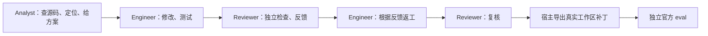

# GPTSwarm + mini：固定多角色协作基线

本基线保留 GPTSwarm 的 `Swarm → CompositeGraph → Graph → Node` 调度、角色子图和前驱消息传递；使用安装的 `mini-swe-agent` 的 `DefaultAgent` 执行每个角色内部的工具循环。没有边搜索、节点优化、拓扑变异或训练。

它替代三独立候选加随机平票的方案，作为本项目接下来验证的“不演进 Swarm”基线。角色和连接是为 SWE 任务显式设计的固定配置，不应称为论文所有默认设置的复现。

## 三个角色、一次有界返工



- **Analyst**：读取源码，提交具体文件/函数、实现建议、边界情况和测试命令。
- **Engineer**：接收 Analyst 的实际消息，实施修改与测试；收到 Reviewer 的意见后返工。
- **Reviewer**：检查实现工作区的快照，执行验证，返回 `APPROVE`、`REQUEST_CHANGES` 或 `UNVERIFIED` 及具体证据。
- Engineer 和 Reviewer 各有两个阶段节点，所以是 **3 个逻辑 agent、5 个角色执行节点、1 个非模型导出节点**。返工在 DAG 中展开，不需要循环边或优化器。每阶段启动新的 mini 会话，跨阶段状态由显式消息和工作区保存。
- 首次审查明确批准且补丁 hash 未变化时，跳过返工和重复审查；否则最多返工一次。最终未获批准仍导出实际补丁送官方 eval，同时保留本地审查状态。审查意见不是官方正确性标签。
- 各阶段按依赖顺序执行，语义是协作，不是并行采样。保留 Engineer 初始节点到返工节点、Reviewer 初审到复核节点的角色内部边，以及角色之间的通信边。

代码：`swarm/environment/agents/swe_bench/mini_collaboration.py`。

## 工作区与消息

Engineer 使用同一个可写容器，返工保留首次实现。Analyst 使用基线副本，Reviewer 每次使用“基线 + 当前实际 patch”的独立容器。它们的源码改动不传回 Engineer；若检查阶段修改了源码或测试，记录 `ReadOnlyViolation`，其审查不能批准。

这不是 OS 层只读挂载：检查者可以在容器内运行测试和写 `/tmp`，但源码变动会被检测、丢弃。检查脚本/报告要求放在 `/tmp`。独立审查副本也避免继承实现员对测试的改动。

只有根节点接收直接任务输入，其余节点从 `predecessor.outputs` 合并消息。每条消息包含发送节点、角色、阶段、退出状态、报告、检查证据和对应补丁 hash。worker 的 `request.json` 保存真实收到的消息，便于证明交接已进入模型上下文。

角色使用同一个已安装的 `DefaultAgent` 实现，但分别追加 Analyst、Engineer、Reviewer 的独立 system 指令，并使用阶段任务模板。当前协议为 `shared_task_budget_v4`，提示词位于 `mini_prompts.py`，预算与标准继承策略位于 `mini_policy.py`，交接与批准校验位于 `mini_protocol.py`。

各角色边执行边更新 `/tmp/swarm-handoff.json`，分别记录事实、假设、验收标准、修改、检查证据、未决问题和发现。整题共享 1,200 秒，角色 `seconds` 是建议交接时间，不再是硬截止。距离建议交接时间或整题截止不足 `report_seconds=60` 秒时提醒收尾，允许完成必要的简短验证。单次请求上限为 `api_timeout=300` 秒与整题剩余时间减 5 秒的较小值，不按角色配额截断请求，也不扣除 60 秒报告提醒额度。

已取消 `min_request_seconds=45`：即使剩余时间不足 45 秒，仍允许模型调用和报告提交。只有整题进入最后 5 秒回收窗口才返回 `TaskBudgetExhausted`。超时或耗尽时优先回收结构化 checkpoint，否则回收最近工具观察，明确标注未完成。共享时间不保证每个后续角色都有足够时间；角色仍需遵循交接提醒，步数限制也继续生效。

首次审查只收到公开题目和待审补丁，先保存自己的验收标准，再由工具交付前驱报告。如果在同一条命令中首次保存标准并提交，worker 会推迟提交，让下一次模型请求先获得前驱报告。`model_request.predecessors_in_context` 记录交接是否进入调用上下文。

最终复核在第一条请求中直接获得初审、返工报告和证据，继承初审记录的标准，优先处理未决项；不重复执行延迟披露。必须在当前快照运行自己的行为/回归检查，不能仅凭前驱通过记录批准。若初审没有留下标准，复核自行建立并记录为非独立建立。最终报告须保留继承的标准，可以追加细化条目。各角色提示词还要求针对实质歧义列出竞争解释、公开依据及区分它们的检查，不将猜测悄悄变成事实；这些指令不保证模型一定遵守或正确判断。

`swe-check` 将命令真实退出码和输出单独写入检查日志，worker 为其分配检查 ID，并记录执行前后的源码指纹。批准必须引用当前源码上的成功行为断言和另一次回归检查，覆盖所有验收标准；未解决问题或失败检查会阻止批准。测试命令调用错误可以由修正后的成功检查解释；实际失败若称为基线已有，须在额外的干净基线容器执行相同命令，并提供匹配的失败摘要。使用 `swe-check --baseline ...` 执行该对照，不涉及隐藏评估测试。外层 `echo` 返回 0 不能覆盖检查记录中的失败。

以上是执行证据校验，不是对断言正确性或补丁正确性的证明。批准未通过时会把具体原因送入有界返工，最终仍由官方 eval 判定。

生成只接收公开 `problem_statement`，不向模型提供 hints、gold patch、gold test patch、FAIL_TO_PASS 或 PASS_TO_PASS 名称。

## mini 依赖与预算

GPTSwarm 和 mini 使用不同 Python 进程，避免把现有环境依赖强行混装。`--mini-python` 指向已安装 mini 的解释器，或设置 `MINISWE_PYTHON`。目前环境使用 mini 2.4.6；这份安装含既有本地适配，不声称是未经修改的上游版本。每阶段记录实际版本和关键依赖文件 hash。

我们没有自行重写 mini 的推理/工具迭代器。适配层负责 Docker 命令、角色模板、预算、调用日志和退出后的工件回收。mini 的任务模板改为角色报告协议；最终 patch 由宿主从 Git 导出，不采信模型手写 diff。

默认配置：`config/swebench/mini_fixed.json`。

| 阶段 | 建议交接时间（软配额） | 模型调用步数 | 每次最大输出 tokens |
|---|---:|---:|---:|
| 分析 | 240 秒 | 30 | 16384 |
| 首次实现 | 420 秒 | 80 | 16384 |
| 首次审查 | 240 秒 | 35 | 16384 |
| 返工 | 180 秒 | 40 | 16384 |
| 复核 | 120 秒 | 20 | 16384 |

共同任务 deadline 默认 1200 秒，各阶段共享剩余任务时间；导出和容器清理允许额外收尾时间。单次 API 请求上限 300 秒，命令上限 120 秒，均受整题剩余时间约束。角色软配额不是 API 思考时间上限，max_tokens 也不是可见文本的保底额度；记录实际 usage 和 finish_reason 来判断截断。官方 eval 的独立测试时限不计入生成的 20 分钟。

`OPENAI_API_KEY` 和 `OPENAI_BASE_URL` / `OPENAI_API_BASE` 通过进程环境传给 mini，不写入 request/config 文件。完整轨迹含任务源码和模型内容，发布前仍需检查内容。

## 容器、补丁、评估

- 生成和 eval 均显式设为 `network=none`，并 inspect 确认后留存记录。模型请求发生在宿主侧。
- 生成先校验镜像源码与题目基线；若镜像是不同提交但 tree 完全相同，或仅普通文件可执行权限不同且全部 blob 一致，切到真实 base commit 并恢复基线权限。源码内容不同、增删文件或符号链接变化仍拒绝。然后只保留该提交的浅克隆 Git 数据，删除原对象库和远程引用。
- 宿主通过临时 Git index 导出 staged、unstaged、新增和删除文件，不改变 agent 的 index；过滤已有未跟踪环境文件和测试路径。异常/超时也独立回收实际 patch。
- 每次 shell 都通过 `BASH_ENV=/root/.bashrc` 激活镜像环境，使用 `bash -o pipefail -c`。容器内 `timeout -k 2` 控制命令，`swe-check` 保留真实退出码和测试输出。
- 最终仍由官方 SWE-bench harness 独立评估，不向生成回传隐藏评估结果。
- 当前入口针对 **Verified 镜像协议及本地 Verified154 数据**。没有宣称已经支持 Pro 的多语言镜像、子模块及测试协议。

## 运行

在 GPTSwarm 根目录：

```bash
.venv/bin/python -u -m experiments.run_swebench_mini_swarm \
  --mini-python "$MINISWE_PYTHON" \
  --instance-id django__django-10999
```

`--config` 指定独立预算文件，`--data-path` 指定本地完整实例 JSON，`--output-dir` 指定不存在的新输出目录。默认生成后 eval，`--skip-eval` 只用于接入调试。

产物位于 `outputs/swebench/mini_fixed_*`：

- `config.json`：固定图、角色、预算、输入协议、源码 hash。
- `source_at_run/`：启动时的代码副本；worker 从该目录执行，后续代码修改不会混入正在运行的阶段。
- `runtime.jsonl`：容器隔离记录、阶段状态、消息发送和补丁 hash。
- 各阶段目录：真实请求、mini 轨迹、逐调用 usage/finish_reason、工具结果、交接报告与 patch 快照。
- `trace.json`：原生图各节点真实输出；`generation.json`：生成状态，区分角色失败和正常完成。
- `selected.patch`、`predictions.json`：宿主导出的补丁；`report.json`：官方评估结果。
- `eval_network.jsonl`：实际 eval 容器的断网确认。

## 验证与结论边界

单元测试用原生 `Graph.run` 检查分析消息进入实现员、审查反馈进入返工、变更进入复核、批准跳过返工以及角色异常时保留工作区。真实 Docker 检查覆盖基线 Git 隔离、新文件导出、测试文件排除、补丁传输和审查副本隔离。

单题 smoke 只验证运行链路并提供个案结果，不能证明团队提升解决率。后续全量实验需冻结配置；同能力单 mini、相同总预算对照和多角色固定图结果应分别报告。

### 2026-09-18 接入验收

首版完整试跑（旧报告协议与预算）：`outputs/swebench/mini_fixed_20260918_081012_757242/`，题目 `django__django-10999`。

| 阶段 | 实际结果 |
|---|---|
| Analyst | 遭遇 2 次请求限流，阶段超时；源码/测试工具观察成功回收并进入 Engineer 的真实请求 |
| Engineer | 正常提交，修改 `django/utils/dateparse.py`；期间另有 1 次请求限流 |
| Reviewer | 在独立副本检查真实补丁，正常提交 `APPROVE` |
| 返工 / 复核 | 因批准且补丁未变而跳过；真实返工分支本题未触发，消息传递和返工行为由测试覆盖 |
| 补丁 | 491 字符、非空、官方环境成功应用 |
| 官方 eval | **unresolved：FAIL_TO_PASS 0/2，PASS_TO_PASS 10/10**；0 empty、0 error |

主要角色处理约 12 分钟；整体上限仍为 20 分钟，并非强制每题跑满。API 已返回的 usage 合计：输入 448,029、输出 12,473、总计 460,502 tokens，其中 reasoning 6,085。收到 36 个完成响应，记录 3 次限流错误；未返回的中断请求没有 usage，不应把这些数字当成服务端账单总额。

本地审查批准不等于官方通过。这次结果证明了非空补丁导出、独立审查、消息实际进入下一角色请求以及超时交接的运行链路；不证明协作提高解决率，也不是三个角色均正常完成的无故障样本。官方评估结果未反馈给生成中的角色，没有针对隐藏测试继续调试候选。

验收结束后补充了 Django `runtests.py` 成功输出的日志分类识别，避免只记录失败而遗漏成功检查。`review_checks_reclassified.json` 是对原工具输出的单独重分类；原运行的源码副本、消息、补丁与评估结果未改写，没有因此重新调用模型。

首版验收时 17 项测试通过（原有 6 项 + 新增 11 项）。真实 Docker 检查通过基线树核对/历史隔离、新文件导出、测试文件排除、快照传输与副本修改隔离；正式试跑的生成和 eval 容器均留有 `network=none` 检查记录。

较早的 `mini_fixed_20260918_075959_142595` 与 `mini_fixed_20260918_080300_189403` 是已标记 `ABORTED.json` 的接入调试记录，不计为完整基线运行。后者保留的补丁另行评估为 unresolved，仅用于检查补丁回收与断网 eval。

### 结构化证据协议验证

2026-09-18，27 项 `test_swebench_*py` 测试通过，覆盖固定图消息/返工、检查真实退出码、不同角色提示词、延迟披露、过期或缺失证据、失败项处置与基线比较。读取含 `AssertionError` 的源码不会误报测试失败。

`test/smoke_mini_worker_contract.py` 使用真实 Docker、已安装 mini 的 `DefaultAgent` 和固定的模拟模型回复，验证 worker 提交、先保存验收标准再披露前驱、行为与回归证据批准、基线命令实际返回 7 而外层返回 0 时仍记录失败。它不调用模型 API，也不代表 SWE 解题结果。运行方式：

```bash
.venv/bin/python -m unittest discover -s test -p 'test_swebench_*py' -q
.venv/bin/python test/smoke_mini_worker_contract.py "$MINISWE_PYTHON"
```

### 结构化协议真实复跑：2026-09-18

运行目录：`outputs/swebench/mini_fixed_20260918_085005_147281/`，同一道 `django__django-10999`，使用上述预算和 `structured_evidence_v2`。运行时源码保存在该目录的 `source_at_run/`。

| 阶段 | 真实结果 |
|---|---|
| 分析 | 阶段超时；约第 221 秒才保存 checkpoint，宿主回收结构化事实、假设与未决问题交给实现员 |
| 首次实现 | 正常提交；16 条行为断言和 12 条现有回归测试通过，均补齐包装器检查记录 |
| 初审 | 约第 157 秒保存独立标准并披露前驱，随后 3 次模型请求实际获得报告；13 条行为断言通过，但阶段超时，判为 `unverified`，触发返工 |
| 返工 | 正常提交；按初审标准运行 3 条断言及现有回归测试，补证据但未改变源码补丁 |
| 最终复核 | 正常提交 `UNVERIFIED`，未运行行为/回归检查；直到最终提交时才保存标准，披露后没有下一次模型请求，**没有实际消费返工报告** |
| 补丁 / 官方 eval | 491 字符，与首版补丁逐字节相同；成功应用，**unresolved：FAIL_TO_PASS 0/2，PASS_TO_PASS 10/10** |

生成及角色处理约 1,016 秒（16.9 分钟），状态 `completed_with_role_failures`。已返回的 43 次模型响应合计输入 338,470、输出 27,160、总计 365,630 tokens，包含 reasoning 14,628；另有两次请求 `Timeout`，无 `finish_reason=length`。这些 usage 不包含未返回请求的服务端消耗。所有 6 个生成工作区及官方 eval 容器均留有 `network=none` 记录。

本轮证实结构化超时交接和有界返工真实运行，未完成的审查没有被误判为批准；没有证据表明解决率改善。尚存问题：

- 模型没有遵守“尽早保存报告”的要求；分析和初审都过晚交接。报告预留时间可以回收部分信息，但不保证模型及时完成提交。
- 多角色仍共同接受了 issue 中的局部正则解释，独立报告和自写断言没有纠正需求理解。正确执行错误预期的断言仍会通过。
- 初审自行 `git stash/pop` 比较源码，返工也这样操作，没有使用专用基线入口。最终源码恢复，不触发阶段末的只读检查；当前只读约束不是对瞬时修改的强制阻止。这些手工比较不满足宿主的匹配基线证据协议。
- 最终复核重走初审的延迟披露流程，且是全新会话，造成重复阅读和前驱信息未被消费。`predecessors_disclosed` 事件只说明工具生成了交付内容，不能单独证明该内容进入了下一次模型请求；分析轨迹必须检查后续 `model_request`。

后续改进应优先区分首次独立审查和基于已有标准的复核，让复核及时获得初审标准、未决项和返工证据；同时约束初次交接时机。不能把本次失败归咎于空补丁、eval 依赖缺失或输出 token 截断，也没有将隐藏评估案例写回生成提示词。

### 推理与异常复核

进一步检查原始 `events.jsonl`：43 次返回中 42 次有非空 `message.reasoning_content`，不只是 usage 字段声称有推理。各阶段 reasoning tokens 分别为分析 6,345、实现 1,660、初审 3,061、返工 1,168、复核 2,394，总计 14,628；已返回响应中最大一次 completion 为 4,396，低于配置 16,384，全部以 `tool_calls` 结束。

推理确实讨论过负号含义的歧义，但主要围绕 issue 提议的局部 lookahead 修改及原有测试反复推演。最终实现和检查采用“分量分别带符号”的假设，未修正官方评估要求的整体时间负号语义。自写断言与这套假设一致，故本地通过不等于任务正确。issue 本身确实明确提议该正则修改，原有测试也包含旧语义，不能把错误描述成模型完全无视了明确需求。

两次 API `Timeout` 发生在分析约第 174.5 秒、初审第 168.5 秒。对应请求的实际 timeout 只有 18.62 秒和 10.84 秒，耗时分别约 18.88 秒和 11.10 秒。原因是 `mini_worker.py` 用“阶段剩余时间减报告预留时间”限制探索请求，在临近报告边界时仍发起了很短的请求；日志不能证明服务端故障。报告期又要求停止新测试，与尚未完成独立验证的审查任务产生冲突，轨迹可见角色为此犹豫。之后分析与初审均触及阶段 deadline；实现、返工正常提交。

另有评估计数细节：官方报告仍保留 FAIL_TO_PASS 0/2，但原始 `test_output.txt` 显示真正的断言失败是 `test_negative` 的 5 个子案例。`test_parse_postgresql_format ... ok` 与前一个测试输出连在一行，当前安装的 `parse_log_django` 将组合文本当作测试名，漏掉了独立的 PostgreSQL 测试通过记录。只读复核已确认此解析现象，未改写官方结果；它不改变该题因真实负数语义错误而 unresolved 的结论。

### review_continuity_v3 调整

针对上面的轨迹问题，保留 3 角色固定图和 20 分钟总预算，调整请求预算、报告期提示及最终复核上下文。`min_request_seconds` 独立配置，默认 45 秒；本地主动预算退出被加入 mini 模型的不可重试异常列表，避免退出信号被当成 API 故障不断重试。初审保留独立标准步骤，复核直接继承标准和前驱报告；新的调用日志区分“生成了披露消息”和“消息已经进入模型请求”。提示词对需求歧义的处理保持通用，没有加入本题隐藏测试的案例或期望值。

29 项单元测试通过。Docker 接口测试扩展到三种场景：首次保存标准与提交同一命令时延迟退出、最终复核第一次请求接收返工报告并重新执行检查、可用时间不足时不调用模型且正常回收。测试使用真实安装的 `DefaultAgent` 和模拟模型回复。这一版本的模型解题效果须通过新的真实实验验证；上面的 v2 轨迹及官方结果保持原样。

### v3 真实复跑：2026-09-18

运行：`outputs/swebench/mini_fixed_20260918_092830_876182/`，题目仍为 `django__django-10999`。所有运行源码 hash 与启动副本一致，未在执行中修改配置或向角色补充隐藏评估信息。派生统计见该目录 `trace_analysis.json`。

| 阶段 | 结果及观察 |
|---|---|
| 分析 | 首份 checkpoint 提前到约 50 秒；`RequestBudgetExhausted`，回收结构化报告及检查记录，未正式提交 |
| 实现 | `Submitted`；保留负号语义相关疑问，仍只修改原先那一行正则；自写断言和聚焦回归通过，额外宽泛测试遇到 locale 错误 |
| 初审 | 第 37 秒保存独立标准，后续请求实际收到前驱；已有行为/回归检查，但最后一请求超时，阶段状态 `PhaseTimeout` / `unverified` |
| 返工 | `Submitted`；主要调查初审关于空字符串的断言，认定为基线行为；补丁不变 |
| 最终复核 | **第一次模型请求即包含初审和返工消息，并继承初审标准**；第 22 秒保存 checkpoint；检出真实符号缺陷，但随后 `RequestBudgetExhausted`，未提交完整报告 |
| 官方 eval | 补丁成功应用，**unresolved**；官方报告 FAIL_TO_PASS 0/2、PASS_TO_PASS 10/10，无 empty/error |

生成约 1,064 秒（17.7 分钟），最终补丁 491 字符，与 v2 逐字节相同。6 个生成工作区及 eval 容器全部 `network=none`。收到 57 次响应，usage 合计输入 539,937、输出 29,963、总计 569,900 tokens，其中 reasoning 11,306；全部 `finish_reason=tool_calls`，无输出截断。

本轮所有实际 API 请求时限均大于 45 秒；仍有一次初审 `Timeout`，设置时限 46.80 秒、实际耗时 47.10 秒。它发生在报告期，随后阶段截止；消除 10—20 秒请求并不保证所有调用不超时。

最终复核独立执行了 `parse_duration('-0:5:0')` 的断言，期望负 5 分钟，实际正 5 分钟，产生 `final_review-R001`。这是生成角色在公开输入下自行提出的检查，不是从官方隐藏测试回填。它说明本轮最终复核实际利用了协作上下文并发现了补丁缺陷，但该检查未用包装器，且角色没有将发现更新到最终报告。固定图此时已无后续返工节点，源码最终未修复。

剩余限制更具体了：初审标准曾要求整体负号语义，后续测试却替换成多个分量分别为负的输入，标准文本保留不能保证测试语义一致；返工又被空字符串问题吸引。最小请求预算也会在不足 45 秒时阻止最后一次报告调用，虽然可以回收工具失败证据，却不能保证模型完成归纳。后续若调整流程，应优先保证关键失败及时写入交接，并为检出真实缺陷后的修复留出预算，而非仅增加 max_tokens。官方 0/2 中仍包含前述 Django 日志拼接导致的 PostgreSQL 通过记录漏认；真实负号断言失败足以确定 unresolved，官方结果未改写。

### v4：共享整题时间，取消 45 秒门槛

根据用户对单题约 20 分钟的要求，当前版本取消角色硬截止和 45 秒最小请求门槛。全体角色共享 `task_seconds=1200`，阶段 `seconds` 仅提醒交接，单次 API 上限提升为 300 秒，最后 5 秒留作结果回收。这样角色超出建议时间时，仍可使用整题剩余时间完成思考、验证或交接；不声称共享配额本身已经解决多角色重复探索和后续角色时间不足的问题。

29 项单元测试通过，包括角色建议时间耗尽时请求仍可获得 300 秒、整题剩余 15/30/49 秒时仍可调用。真实 Docker + 已安装 `DefaultAgent` 的模拟模型接口验证通过：初审建议配额设为 1 秒后仍正常完成检查并提交；将共享截止时间调整为只剩 40 秒，分析角色仍完成两次模型调用并提交报告。证据目录 `/tmp/swarm-mini-contract-kd7w4win/`。本次未调用真实模型 API；此前 v2/v3 的实验结果仍对应其各自冻结配置。

### v4 真实复跑：2026-09-18

运行目录：`outputs/swebench/mini_fixed_20260918_095718_956234/`，同题 `django__django-10999`，完整源码和配置已冻结。统计见 `trace_analysis.json`。

生成用时约 **1,128 秒（18.8 分钟）**，首次五个阶段全部 `Submitted`，总状态 `completed`，**零 API 错误、零阶段超时、零预算提前退出**。该状态只表示执行完成，不表示本地审查或官方评估通过。

| 阶段 | worker 用时 | 结果 |
|---|---:|---|
| 分析 | 256 秒 | 正常提交；超过四分钟建议配额仍可完成交接 |
| 实现 | 336 秒 | 正常提交；仍采用单行 lookahead 修改 |
| 初审 | 247 秒 | 正常提交；模型 APPROVE，宿主因未决项、失败处置及证据格式问题判为 unverified |
| 返工 | 149 秒 | 正常提交；主要补证据，补丁不变 |
| 最终复核 | 68 秒 | 正常提交；首个请求即收到前驱；模型 APPROVE，宿主仍判 unverified |

分析、实现、初审的所有 API 请求均获得 300 秒上限。后续请求只随共享整题剩余时间收缩，最终复核最短上限约 88 秒。75 次成功响应的 usage：输入 1,002,721、输出 41,040、总计 1,043,761 tokens，其中 reasoning 20,684；全部结束于 `tool_calls`，无输出截断。

这轮确认时间分配调整改善了交接完整性，但最终补丁仍为同一份 491 字符 diff，与 v3 逐字节一致。角色继续围绕公开 issue 的局部正则建议及旧测试构造预期，自写断言采用分量分别带符号的语义，没有修复整体负号问题；也没有重现 v3 最终复核独立发现的负零案例。因此不能把本轮解题失败归因于 API 额度、请求异常或角色被预算切断。

断网官方 eval：补丁成功应用，**unresolved，FAIL_TO_PASS 0/2、PASS_TO_PASS 10/10**，无 empty/error。原始日志仍是负数测试 5 个真实子案例失败，并存在此前说明的 PostgreSQL 测试通过记录被日志拼接解析遗漏的问题；该问题不改变 unresolved。6 个生成工作区及 eval 容器均有 `network=none` 记录，运行结束后无遗留运行容器。

证据协议仍有适配问题：模型多次打印 `N assertions passed: 12/14`，检查器只识别前置数字形式，导致真实执行完的断言被标为 `unknown`；`cd /testbed && swe-check --baseline ...` 未满足 worker 的独立命令前缀约定，被当作普通参数执行而失败；最终复核也改写了要求原样保留的标准。宿主未批准既包含未决问题等实质原因，也包含这些协议/格式问题，不能将所有阻塞项都解释成测试失败。该运行没有中途修改检查器或重写轨迹，问题留待独立修正与验证。

### 跨项目单题：SymPy 13031，官方通过

运行目录：`outputs/swebench/mini_fixed_20260918_113348_129407/`，题目 `sympy__sympy-13031`。选题只查看公开题面，因其有明确的空矩阵拼接形状示例，且属于不同项目；没有按隐藏测试或标准补丁选题。沿用 v4 的固定团队、共享 1,200 秒、单次 API 300 秒和断网配置。

首先发现一项通用镜像适配缺口：SymPy 镜像的合成提交将 1,382 个普通文件从 100644 改为 100755，所有文件内容 blob 与题目基线一致。原来的完整树一致检查拒绝启动。新增仅权限差异的校验后，仍 checkout 精确 base commit、清除历史，确认 HEAD 为 `2dfa7457f20ee187fbb09b5b6a1631da4458388c`、仅一个提交、工作区干净。30 项单元测试和真实容器准备验证通过，之后才重启模型实验。最初的 `mini_fixed_20260918_112949_697224` 已标记 `ABORTED.json`，零模型调用，不计为完整模型实验；原始空补丁报告保留。

正式运行结果：**官方 resolved，FAIL_TO_PASS 1/1、PASS_TO_PASS 9/9**，补丁成功应用，无 empty/error。实际修改 `sympy/matrices/sparse.py` 的 `row_join` / `col_join`，避免空矩阵快捷返回丢失已累计的行列数；最终补丁 1,081 字符。

| 阶段 | 观察与结果 |
|---|---|
| 分析 | 发现普通稠密 Matrix 已能通过题面示例，继续定位到 MutableSparseMatrix 的相同操作失败；断言复现 `(0,3)` 而非 `(0,6)`，正常提交 |
| 实现 | 修改稀疏矩阵的空矩阵处理，6 条行为断言通过；正常提交 |
| 初审 | 7 条独立断言通过，同一脚本在临时恢复的基线上失败；模型提交 APPROVE，但因基线调用及失败处置不满足协议，宿主判 unverified |
| 返工 | 进入时共享预算只剩约 53 秒；报告保存后，最后一个上限约 5.4 秒的请求超时，阶段超时 |
| 最终复核 | 共享预算耗尽，未运行 |

生成和收尾约 1,206 秒，状态 `completed_with_role_failures`。4 个生成工作区及官方 eval 均 `network=none`；运行中源码未改变，原轨迹保持原样。收到 91 个响应，输入 1,460,357、输出 53,254、合计 1,513,611 tokens，其中 reasoning 24,092；无输出截断。失败请求的服务端消耗不包含在返回 usage 中。

新观察到的检查器缺陷：SymPy 输出 `80 passed, 1 exceptions` 时仍被标为 `tests_passed`，部分命令内部管道又掩盖了退出码。实现员和审查员也未在最终报告中准确保留该异常，不能称其本地回归全部通过。官方本题运行的 sparse 测试通过，因此整题 resolved 有独立依据；不以错误的本地分类支持成功结论。

结论边界：换题后可以得到官方正确补丁，说明 Django 单题失败不足以证明执行器无法完成 SWE 任务。本轮仍暴露初审耗时约七分钟、挤占返工/复核，以及检查协议脆弱的问题。正确补丁主要在实现阶段形成；没有同预算单 mini 对照，不能把这次成功归因于多角色协作带来的增益。

### 全量按域并行：2026-09-18

用户授权启动完整 154 题，正式批次目录 `outputs/swebench/mini_full_20260918_domains_v4b/`。4 个仓库域同时运行，域内逐题生成并执行官方评估：Django 59、SymPy 39、Sphinx 33、Matplotlib 23。全部重新运行，不复用先前单题试验结果；固定三角色、五阶段协作图，不优化边或节点。沿用 v4 共享整题 1,200 秒、API 上限 300 秒、各阶段单次输出上限 16,384 tokens；官方评估另有 1,800 秒测试超时。

最初的 `mini_full_20260918_domains_v4/` 已标记 `ABORTED.json` 并停止、清理本批容器，保留 4 个被中断的启动尝试，不计入正式结果。原因是 Sphinx 镜像的合成提交对 `tox.ini` 添加 pytest `-rA` 参数，原先只允许 chmod 差异的准备检查拒绝启动。新准备逻辑在任何模型访问前 checkout 数据集精确 base commit，校验 HEAD 与已跟踪工作区/暂存区干净，再清除其他 Git 历史；构建提交的差异仅在宿主记录，不作为待修代码交给模型。不再要求镜像构建 HEAD 与数据集基线具有同一源码树，也没有修改共享镜像。新批次增加全量断网容器准备预检（`--preflight-only`），不调用模型。

入口 `experiments/run_swebench_mini_batch.py` 将 `swarm`、`experiments`、`config` 和实际安装的 `minisweagent` 包复制到批次 `source/`，冻结数据与配置并记录 SHA-256。每道题的主进程和 mini worker 都使用冻结副本，凭据仅从原项目环境文件加载到进程环境，不复制进快照。154 题的两套镜像标签均已预检存在，并记录镜像 ID。Python 环境的其他第三方依赖不复制，运行期间应保持环境和镜像不变。

批次后台独立进程 PID 记录在 `launcher.pid`，进度为 `status.json`，逐题结果为 `results.jsonl`，日志为 `batch.log` 和 `task_logs/`。每题完整轨迹、补丁、官方报告位于 `instances/`；评估详细日志位于 `source/logs/run_evaluation/`。官方 resolved/unresolved、空补丁、生成错误、评估错误分开统计。角色超时仍可导出实际补丁并参加官方评估。此批不自动重试失败题，也不以本地审查批准代替官方成功。

生成和评估继续强制、检查 `network=none`。仅增加逐题 `gptswarm.run` 容器标签，用于异常收尾；清理不触及其他实验。整题进程超过 3,600 秒时终止并记录错误，正常生成预算没有因此增加。批次每 30 秒更新状态；文件锁防止重复调度。显式续跑跳过已结束的题，未完成尝试保留并使用新目录；检测到旧任务进程仍在时拒绝重复运行。

启动命令（新批次准备目录必须不存在）：

```bash
.venv/bin/python -m experiments.run_swebench_mini_batch --prepare-only --batch-dir outputs/swebench/mini_full_20260918_domains_v4b
# 运行冻结入口；长任务应由独立后台进程承载。
.venv/bin/python outputs/swebench/mini_full_20260918_domains_v4b/source/experiments/run_swebench_mini_batch.py --batch-dir outputs/swebench/mini_full_20260918_domains_v4b
```

验证：24 项 mini 协作/协议单元测试通过；真实已知成功/失败报告的汇总分类通过；无模型调用的四任务双域调度与续跑检查通过，已结束任务没有重复执行。此前观察到的本地检查证据格式、基线命令和共享预算挤占问题在本批中保留，未根据单题隐藏评估反馈修改提示词或检查逻辑。全量解决率须等待官方评估汇总，不能由先前 SymPy 单题推断。

正式启动前，冻结版本的实际 `MiniRuntime.prepare()` / `export()` / `close()` 已在全部 **154/154** 题通过：恢复精确基线、单提交浅历史、工作区无补丁、断网并正常回收。证据为批次 `preflight.json`、`preflight.log` 和 `preflight/*/runtime.jsonl`。随后启动独立后台调度进程（初始 PID `1220263`；以 `launcher.pid` / `status.json` 为准），四域各有一个活动任务。

启动复核时四域均已有真实模型响应、工具执行和 checkpoint，8 个生成工作区全部断网。接口曾返回请求限流 `RateLimitError`，内置重试后四域均继续获得成功响应；不能把这些异常记为额度耗尽，也不能声称本批零 API 错误。没有为了限流中途修改冻结预算或提示词，限流等待仍消耗共享墙钟预算。启动摘要见 `startup_check.json`；后续应结合原始轨迹统计限流对有效执行时间的影响。

### 全量完成及实验报告：2026-09-20

正式批次于 2026-09-19 10:29:01 UTC 完成，官方解决 102/154（66.23%），49 题未解决、3 题空补丁。整批墙钟 22.201 小时，累计任务时间 58.630 小时，平均逐题端到端 22.84 分钟。12,193 个模型响应记录的输入/输出 token 分别为 200,212,805 / 6,589,142，总计 206,801,947；reasoning 3,085,673 已包含在输出中。未返回 usage 的失败/取消请求消耗未知，不能将此数视为完整账单。

完整报告与图表：[实验报告](experiments/mini_full_20260918/experiment_report.md)。附结构化 JSON、154 行逐题 CSV、770 行逐阶段 CSV、原始统计输入 hash 和可复现脚本；统计仅使用已完成批次，没有重新调用模型或评估。主要限制是 129 题存在角色非正常退出、2,763 次请求限流，以及缺少同预算单 mini 对照，不能直接宣称多角色协作的因果增益。
