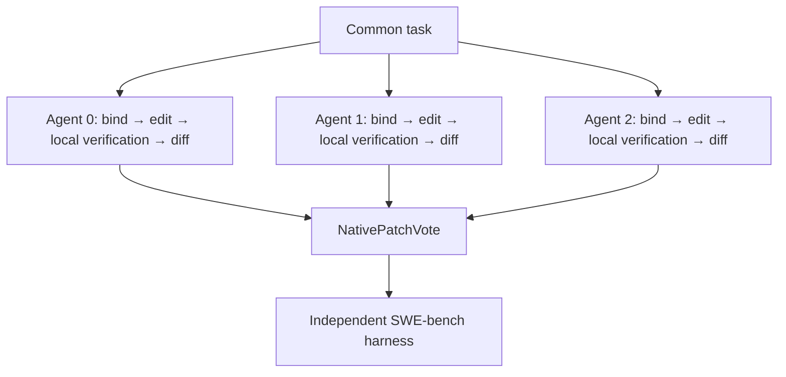

# Native unoptimized Swarm baseline

Historical independent-candidate baseline. The current multi-role, fixed-edge
baseline is documented in [swebench_mini_fixed_baseline.md](swebench_mini_fixed_baseline.md).

Single-agent and team runs use exactly the same `SWECapableAgent`. Change
`--agents 1` to `--agents 3` to change the number of independent candidates.
The old `SWECodeAgent` / `SWEReActCodeAgent` / `SWEMultiStepAgent` mixture is
not used by this entry point. Historical scripts and results are retained.

## Agent capabilities

Each agent has its own container from the same instance image, with networking
disabled and `/testbed` as the workspace. No writable workspace is shared.

1. `WorkspaceInput`: bind that agent's container to the common task.
2. `SourceEdit`: list tracked Python files; search source with up to 12 terms
   derived from the issue; have the model select up to 3 files; read actual
   source (up to 30,000 characters/file); generate and apply SEARCH/REPLACE
   edits. Up to 2 initial attempts, each with one unmatched-block repair call.
   Syntax-check initial edits using the testbed environment and restore files
   whose initial edits do not compile.
3. `LocalVerification`: generate and execute an issue reproduction script and
   a small existing regression-test subset. Up to 3 verification rounds and
   2 intervening repair calls. Reproduction timeout: 180 seconds; regression
   timeout: 420 seconds. Regression subset: first 5 PASS_TO_PASS identifiers
   (SymPy command uses at most 3). Unavailable regression runs are recorded as
   unavailable. These are local checks, not the official evaluation.
4. `WorkspaceDiff`: export `git diff HEAD`, reject test-file edits, check all
   modified Python files for syntax errors, and reverse-apply-check the diff
   against the edited tree. Emit exactly one candidate. Empty/invalid edits
   yield an empty candidate; model-written diff text is never a fallback.

This is a bounded repair agent, not an unrestricted shell tool-calling agent.
Current edits target existing files; untracked new files are not exported.
No gold source patch or gold test patch is included in agent inputs. Existing
dataset hints and test names remain available equally to single and team runs.

## Team topology and interaction



Native `Swarm` / `CompositeGraph` / `Node` execution is retained.
`edge_optimize=False`, `node_optimize=False`, no candidate cross-agent edges,
no topology search or mutation, one traversal of the team graph. Local agent
verification loops are fixed and identical in single-agent and team settings.
The existing graph executor schedules nodes sequentially; three branches do
not imply simultaneous model execution.

Each agent sends exactly one final workspace patch to the final node. Valid,
nonempty identical patch strings receive votes. Invalid/empty candidates
abstain. Ties between distinct patch strings use a local seeded RNG; the
selected patch is preserved verbatim, with no extra model rewriting or repair.
If every candidate is invalid/empty, output is empty. There is no direct
agent-to-agent communication and no feedback from the harness to generation.
Local check success does not determine voting weights or prove resolution.

Model: DeepSeek-V4-Flash-0731; temperature 0.2; one completion/call.
Model output limits: localization 400 tokens, editing/repair 8192,
reproduction 2000. Graph node timeout 2400 seconds, one node attempt.
`--seed` controls tie selection and host randomness, not API sampling.

## Run and inspect

```bash
.venv/bin/python -m experiments.run_swebench_native_smoke --agents 1 --instance-id django__django-10999
.venv/bin/python -m experiments.run_swebench_native_smoke --agents 3 --instance-id django__django-10999
```

Each run writes to a separate `outputs/swebench/native_capable_aN_*` directory:
`config.json` (actual graph, limits, containers, wall time), `trace.json`
(node outputs and local test evidence), `candidates.json`, `predictions.json`,
`selected.patch`, and `report.json` after harness evaluation. `--skip-eval`
only skips the final harness. Containers are removed after generation.

The default is one case, three agents. A one-case smoke test validates the
integration; it does not establish an accuracy improvement. A team run has
three times the per-agent budget, so equal-budget comparisons are a separate
experimental condition. This runner does not yet save exact API token usage.
